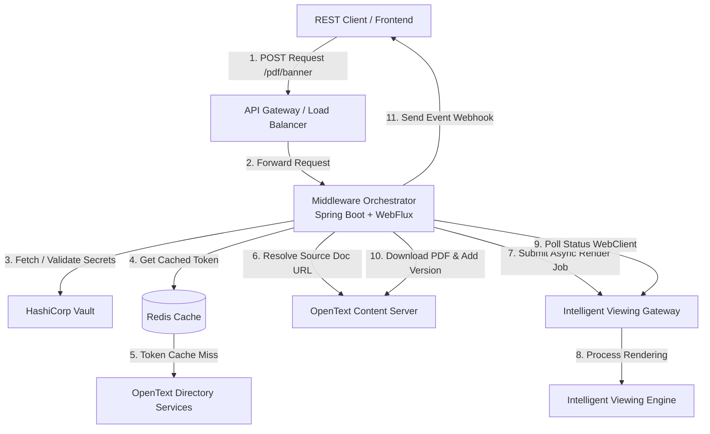
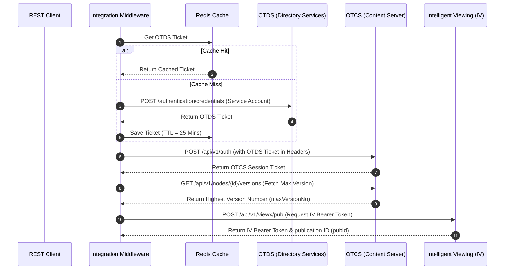
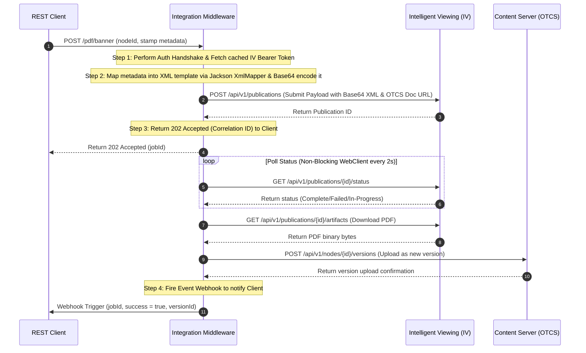
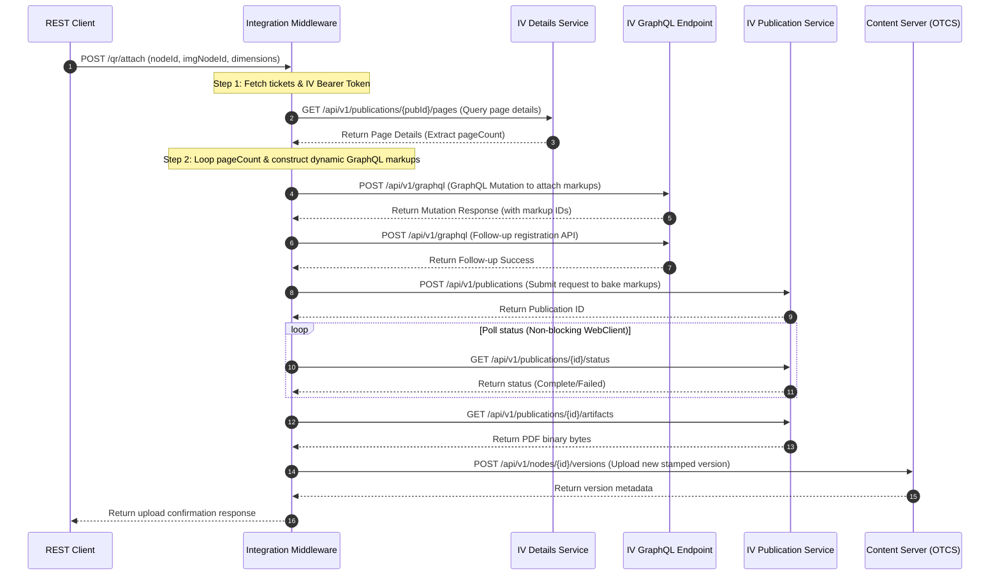
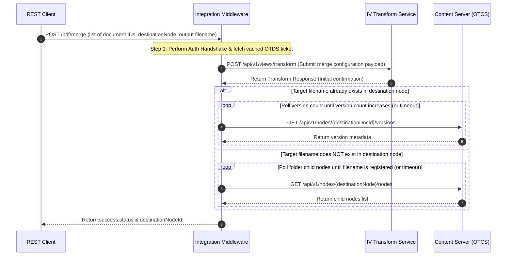

# Interview Preparation: OpenText IV & OTCS Integration Service
## (Enterprise Best-Practice Architecture Edition)

This guide prepares you to discuss the **1_IV_Integration** (P03_IV_Integration) project in interviews. It outlines the complete in-depth High-Level Design (HLD), reactive data flows, coding patterns, and "high-impact" talking points that showcase senior-level engineering experience.

---

## 1. High-Level Design (HLD) & Architectural Specification

This microservice is a **middleware orchestration gateway** designed to sit between client applications (frontends, workflow engines, or enterprise service buses) and the OpenText enterprise content ecosystem. It abstracts and automates complex multi-system document operations like watermarking, stamping, merging PDFs, and applying QR code markups.

### System Boundaries & Context
In enterprise environments, document transformation must be secure, transactionally sound, and scalable. The middleware coordinates three core downstream services:
1. **OpenText Directory Services (OTDS)**: The identity manager, providing security tickets.
2. **OpenText Content Server (OTCS)**: The enterprise document repository storing files and version metadata.
3. **OpenText Intelligent Viewing (IV)**: The high-performance transformation engine that processes renderings, stamps, and layout structures.

### Component Architecture & Responsibilities
*   **Controller Layer (`ReqController.java`)**: Exposes REST endpoints, validates inputs at the API boundaries using Spring's `@Valid`, and returns immediate `202 Accepted` correlation tokens for async endpoints.
*   **Orchestration Layer (`ToPdfSercice`, `PdfService1`)**: Houses the workflow state machines. It orchestrates the order of operations, computes QR coordinates, handles polling logic using reactive timers, and commits files.
*   **Client Integration Layer (`IVTicket`, `AddVersion`, `ApplyQr`)**: Integrates with downstream OpenText APIs using **Spring WebClient** for non-blocking HTTP transactions. It features custom interceptors for session cookie handling and uses **Resilience4j** for retries and circuit breakers.
*   **Security & Configuration Layer**:
    *   `OtdsToken`: Handles token exchange with OTDS.
    *   `RedisCacheConfig`: Configures token caching with TTL matching ticket expiration.
    *   `AppConfig`: Configures thread pools, connections, and Jackson serializers.

---

### Core Architectural Design Patterns & Best Practices

1.  **Orchestrator Pattern**:
    *   The middleware acts as a single point of orchestration, coordinating distributed transactions across three independent systems (OTDS, OTCS, and IV). This simplifies client-side code and reduces mobile/web network roundtrips.
2.  **Reactive & Non-Blocking Concurrency**:
    *   Built using **Spring WebFlux and WebClient**. Instead of blocking threads with `Thread.sleep` during IV's high-latency document rendering loops, we use non-blocking reactive schedules (`Flux.interval`), ensuring zero thread starvation on servlet container threads under heavy loads.
3.  **Distributed Caching**:
    *   Utilizes **Redis** to cache OTDS and OTCS authentication tickets. Since tokens are valid for up to 30 minutes, caching them with a corresponding Time-To-Live (TTL) bypasses authentication handshakes for 99% of subsequent requests.
4.  **Resilience & Fault Tolerance**:
    *   Leverages **Resilience4j** to implement **Circuit Breakers** and **Retry Policies with Exponential Backoff**. If IV experiences high latency or crashes, the circuit breaker opens to fail fast and protect system threads.
5.  **External Secret Management**:
    *   Service credentials and system passwords are kept secure and injected at startup from **HashiCorp Vault** or **AWS Secrets Manager**, avoiding hardcoded properties in configuration files.

---

## 2. Core API Flows & Business Logic (Sequencing)

### A. Secure Token & Ticket Exchange (Three-Legged Token Flow)
Secures operations by exchanging credential tickets across Directory Services, the repository, and the viewing gateway.

---

### B. PDF Rendition & Watermarking/Banner Pipeline
Converts standard documents (e.g., Office, CAD, Images) into a standard PDF with dynamic header/footer banners and watermarks generated on-the-fly via XML schemas.

---

### C. GraphQL QR Code Placement & Baking
GraphQL-based flow that dynamically measures page structures and bakes a QR code image overlay onto all pages of a document.

---

### D. Document Merging & Verification Flow
Consolidates multiple files into a single repository PDF, verifying status by polling the file's presence in OTCS.

---

## 3. High-Quality Coding Practices

*   **HTTP Client Optimization (Connection Pooling)**: Configured a single, shared `OkHttpClient` instance as a Spring bean rather than instantiating a new client on each request. This enables TCP connection reuse, reduces handshaking overhead, and prevents socket exhaustion under high loads.
*   **Automatic Cookie Persistence**: Integrated a custom `CookieJar` inside the `OkHttpClient` builder to seamlessly manage stateful session cookies returned by OpenText gateway filters.
*   **Resilience (Retry Logic)**: The PDF download service uses a robust retry mechanism (up to 3 attempts with a 2-second sleep interval) to handle transient network blips or temporary downstream delays.
*   **Centralized Exception Translation**: Developed a `@RestControllerAdvice` along with a custom `ExternalApiException`. When any OpenText API returns a non-2xx code, the service intercepts it, logs the exact request URL, HTTP status, and error payload, and maps it to a standardized JSON error response. This keeps the application from leaking stack traces and simplifies API debugging.

---

## 4. Potential Interview Questions and Answers

### Q1: Can you describe the High-Level Design of your integration middleware?
*   **Answer**: "Yes, the middleware is designed as a stateless Spring Boot orchestration layer. It exposes standardized REST endpoints to external clients and coordinates distributed transactions across the OpenText ecosystem. The HLD consists of a Controller layer for input validation, an Orchestration Service layer that maintains the workflow state machines, and an API/Client integration layer built on a shared, pooled OkHttpClient. We use a three-legged authentication flow exchanging credentials dynamically between OTDS, OTCS, and Intelligent Viewing to perform actions headlessly."

### Q2: How did you handle document rendering status checks since IV rendering is asynchronous?
*   **Answer**: "OpenText Intelligent Viewing handles document rendering asynchronously. When we submit a publication, it returns a publication ID. I implemented a polling loop that queries the IV status API every 2 seconds. The loop runs until the status changes to `Complete` or `Failed`. Once complete, the service proceeds to download the artifact bytes. To prevent infinite loops in case of downstream failures, I implemented a timeout based on `Instant.now().plus(Duration.ofMinutes(timeout))`."
*   *Bonus Senior Point*: "In a production environment, I recommended shifting this polling to a message-driven approach or using Spring's task scheduler to avoid blocking worker threads."

### Q3: What is the purpose of the base64-encoded XML in the publication payload?
*   **Answer**: "OpenText Intelligent Viewing uses a specific XML schema called `IsoBannersAndWatermarks` to define overlay layouts (like headers, footers, page numbers, and stamp texts). I created dynamic XML templates and mapped them using Jackson's `XmlMapper`. Since IV accepts watermarking configuration as a data URI in the JSON request, we base64-encode the generated XML and pass it under the `ApplyBannersWatermarks` feature path as `data:application/xml;base64,{encodedXML}`."

### Q4: How did you handle errors returned by external OpenText APIs?
*   **Answer**: "We developed a centralized exception handler using `@RestControllerAdvice`. I created a custom `ExternalApiException` that wraps the HTTP status code, target URL, api context, and the JSON error body returned by OpenText. If a call to OTCS or IV fails, we throw this exception. The global exception handler intercepts it, logs the details, and returns a structured JSON payload to our API clients with the appropriate HTTP status code, ensuring full transparency for API debugging."

### Q5: Why did you choose OkHttp over Spring's RestTemplate or WebClient?
*   **Answer**: "At the time, we chose OkHttp because it is a lightweight, high-performance HTTP client that offers excellent control over connection pooling, timeouts, and custom interceptors out-of-the-box. Additionally, its built-in `CookieJar` interface made it extremely easy to manage session cookies across stateful redirect queries. However, for newer reactive modules, we are looking at migrating to Spring's `WebClient` for non-blocking I/O."
