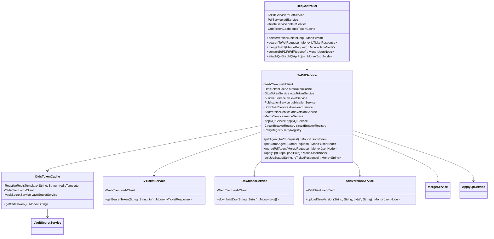

# Low-Level Design (LLD): OpenText IV & OTCS Integration Service
## (Enterprise Best-Practice Edition)

This document describes the Low-Level Design (LLD) of the **P03_IV_Integration** microservice utilizing modern enterprise architecture patterns. It covers class specifications, reactive method interfaces, DTO models, caching structures, resilience decorators, and exception handlers.

---

## 1. Class Structure & Reactive Dependency Graph

The design utilizes a reactive stack with Spring WebFlux. Incoming requests are received by controllers, validated, and delegated to orchestration services. The orchestration services utilize non-blocking WebClient wrappers, Resilience4j registries, and Redis cache integrations.



---

## 2. Class & Method Specifications (Best Practices)

### A. Controller Layer

#### `ReqController` (annotated with `@RestController`, `@RequestMapping("/api/v1")`)
Handles external REST traffic. Leverages non-blocking Project Reactor types (`Mono` and `Flux`) to ensure maximum thread utility.
*   **Endpoints**:
    *   `POST /pdf/banner`: Submits a watermarking request.
        *   *Params*: `@RequestBody @Valid PdfRequest request`
        *   *Returns*: `Mono<ResponseEntity<JsonNode>>` (Returns `202 Accepted` with correlation jobId)
    *   `POST /qr/attach`: Triggers QR overlay pipeline.
        *   *Params*: `@RequestBody @Valid GraphQlApiPojo request`
        *   *Returns*: `Mono<JsonNode>`
    *   `POST /pdf/merge`: Merges files and monitors creation asynchronously.
        *   *Params*: `@RequestBody @Valid MergeRequest request`
        *   *Returns*: `Mono<JsonNode>`

---

### B. Core Services & Orchestration Layer

#### `ToPdfService` (annotated with `@Service`)
Coordinates reactive flows across directories, content repositories, and transformation services.
*   **Methods**:
    *   `pdfStampAgent(StampRequest request)`:
        *   *Flow*: Chains reactive operators to fetch tokens, generate XML payloads, submit jobs, poll status, download bytes, and commit back.
    *   `pollJobStatus(String jobId, String token)`:
        *   *Implementation*: Avoids `Thread.sleep` by using reactive intervals (`Flux.interval`) combined with flat mapping and timeout constraints:
            ```java
            public Mono<String> pollJobStatus(String jobId, String token) {
                return Flux.interval(Duration.ofSeconds(2))
                    .flatMap(tick -> webClient.get()
                        .uri("/api/v1/publications/{id}/status", jobId)
                        .headers(h -> h.setBearerAuth(token))
                        .retrieve()
                        .bodyToMono(JsonNode.class))
                    .map(json -> json.get("status").asText())
                    .filter(status -> status.equals("Complete") || status.equals("Failed"))
                    .next() // Get first completion state
                    .timeout(Duration.ofMinutes(5)) // Protect against infinite hangs
                    .flatMap(status -> status.equals("Complete") ? 
                        Mono.just(jobId) : Mono.error(new ExternalApiException(500, "Job Failed")));
            }
            ```

#### `OtdsTokenCache` (annotated with `@Component`)
Integrates a caching layer to store identity tokens in Redis to minimize authentication handshakes.
*   **Methods**:
    *   `getOtdsToken()`: 
        *   *Logic*: Checks Redis for the ticket under key `"otds:ticket"`. If present, returns it (Cache Hit). If missing (Cache Miss), fetches credentials from HashiCorp Vault, authentication via OTDS API, saves the ticket in Redis with a TTL of 25 minutes, and returns the token.

---

### C. Client Integration & Resilience Layer

#### `DownloadService` (annotated with `@Component`)
Downloads transformed binaries. Incorporates **Resilience4j** annotations to wrap network interactions in Retry policies and Circuit Breakers.
*   **Methods**:
    *   `downloadDoc(String publicationId, String token)`:
        *   *Decorator*: `@CircuitBreaker(name = "intelligentViewing", fallbackMethod = "fallbackDownload")`
        *   *Decorator*: `@Retry(name = "downloadRetry")`
        *   *Signature*: `public Mono<byte[]> downloadDoc(String publicationId, String token)`

---

## 3. Data Transfer Objects (DTO) & Mappings

### A. GraphQL QR Markup Variable payload (`GraphQlApiPojo.java`)
Structures variables for attachment:

```json
{
  "query": "mutation createMarkups($markups: [MarkupInput!]!) { createMarkups(markups: $markups) { id } }",
  "variables": {
    "markups": [
      {
        "mimeType": "image/png",
        "matrix": [1, 0, 0, 1, 100, 100],
        "imageWidth": 120,
        "imageHeight": 120,
        "title": "QRCode_Overlay",
        "author": "SystemAccount",
        "uri": "http://otcs/api/v1/nodes/{imgNodeId}/versions/{imgVersion}/content",
        "name": "{imgNodeId}",
        "pid": "{pubId}",
        "source": "{verId}",
        "page": 0
      }
    ]
  }
}
```

### B. Jackson XML Banner Serialization Schema
Maps dynamically generated banner details into target layout nodes:

```xml
<IsoBannersAndWatermarks xmlns="http://opentext.com/brava/banners">
    <Banners>
        <Banner>
            <Location>TopCenter</Location>
            <Color>#FF0000</Color>
            <TextFragment>
                <Text>RESTRICTED DOCUMENT</Text>
            </TextFragment>
        </Banner>
        <Banner>
            <Location>BottomRight</Location>
            <Color>#FF0000</Color>
            <TextFragment>
                <Text>Printed On: {printedOnDate}</Text>
            </TextFragment>
        </Banner>
    </Banners>
</IsoBannersAndWatermarks>
```

---

## 4. Exception Handling & Resilience Architecture

### Resilience4j Configurations (`application.yml`)
Configures policies for Downstream API calls:

```yaml
resilience4j:
  circuitbreaker:
    instances:
      intelligentViewing:
        slidingWindowType: COUNT_BASED
        slidingWindowSize: 10
        minimumNumberOfCalls: 5
        failureRateThreshold: 50
        waitDurationInOpenState: 10000 # Wait 10s before half-open state
        automaticTransitionFromOpenToHalfOpenEnabled: true
  retry:
    instances:
      downloadRetry:
        maxAttempts: 3
        waitDuration: 2000
        exponentialBackoff:
          enabled: true
          multiplier: 2.0
```

### Exception Handler (`GlobalExceptionHandler.java`)
Translates runtime failures and handles fallbacks.

*   **`ExternalApiException`**: Custom runtime exception capturing HTTP codes, context, invoked URLs, and error payloads.
*   **Methods**:
    *   `handleExternalApiError(ExternalApiException ex)`: Maps exceptions into a standardized client response:
        ```json
        {
          "status": 502,
          "error": "Bad Gateway",
          "message": "Downstream transform operation failed.",
          "apiContext": "IV Publication Service",
          "url": "http://iv-engine/api/v1/publications",
          "timestamp": "2026-07-06T18:00:00Z"
        }
        ```
    *   `handleCircuitBreakerOpen(CallNotPermittedException ex)`: Intercepts requests sent when the circuit breaker is open, immediately returning a `503 Service Unavailable` with a user-friendly message, preventing cascading downstream load.
