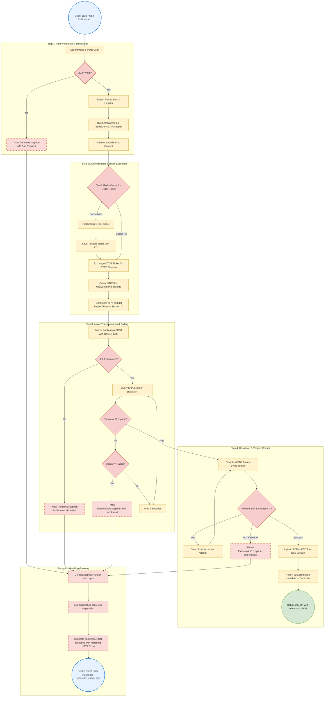
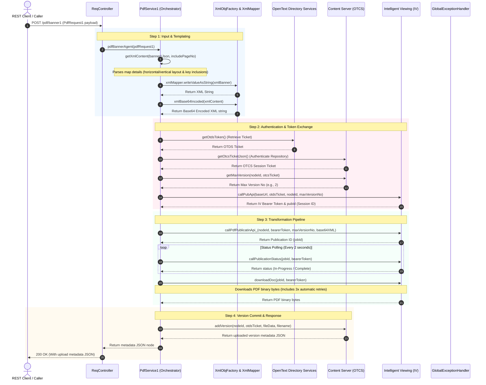

# Operational Flow & Exception Handling: `/pdf/banner1`

This document details the complete end-to-end execution flow and exception propagation system for the `/pdf/banner1` endpoint.

---

## 1. Process Flow Diagram (Boxes & Arrows)

This flowchart traces the step-by-step process of the `/pdf/banner1` endpoint, highlighting decision gates (diamonds), logical operations (rectangles), and the execution path.

---

## 2. Happy Path Sequence Diagram

---

## 3. Step-by-Step Execution Mechanics

1.  **Entry Point (`ReqController.java#convertToPDF1`)**:
    *   Exposes a HTTP `POST` mapping at `/pdf/banner1`.
    *   Receives `PdfRequest1` as the JSON request body (deserialized automatically by Jackson).
    *   Attempts to serialize the request object to log the payload. If an error occurs, it throws a `RuntimeException`. Otherwise, it invokes `pdfService1.pdfBannerAgent(request)`.
2.  **XML Generation (`PdfService1.java#getXmlContent`)**:
    *   Extracts location-specific text fields (`TopCenter`, `BottomLeft`, etc.) and font heights from the payload.
    *   Helper `getContentOfLocation` parses key-value maps inside each banner block:
        *   If `horizontal == true`: Formats map values separated by `" | "`.
        *   If `horizontal == false`: Formats map values separated by `"&#10;"` (numeric entity for line break).
        *   If `includesKey == true`: Prepends the key name to the value (e.g. `"Printed By : user1"`).
    *   Builds the `XmlBanner1` structural object and converts it to an XML String using `XmlMapper`.
    *   Post-processes the string replacing double-escaped entities (`&amp;#` back to `&#`) and base64 encodes the XML.
3.  **Token Exchange & Document Validation**:
    *   Calls `OtdsToken#getOtdsToken` to retrieve the active OTDS Ticket.
    *   Calls `OtcsToken#getOtcsTicketJson` to retrieve the active OTCS Session Ticket.
    *   Invokes `AllVersions#getMaxVersion` to fetch the highest current version of the node in Content Server.
    *   Sends a POST to IV's `/pub` ticket endpoint via `IVTicket#callPubApi`, obtaining an IV Bearer token and rendering session ID.
4.  **IV Document Publication & Polling**:
    *   Submits the transformation request to IV containing the document URL in OTCS and the base64 XML banner config.
    *   Receives a `Publication ID` and calls `checkStatus()`.
    *   Executes a polling loop every 2 seconds, querying `PublicationStatus` until the job returns `"Complete"`.
5.  **Download & Versioning**:
    *   Downloads the generated PDF bytes from IV using the Bearer Token.
    *   Calls `AddVersion#addVersion` to upload the bytes to OTCS as a new version under `request.getFinalDocName()`.
    *   Returns the upload metadata JSON response back to the REST client.

---

## 4. Exception Handling & Propagation Details

### Downstream Error Translation Flow
1.  **Downstream API Call Interception**:
    *   HTTP clients (e.g. `OtdsToken`, `IVTicket`, `DownloadArtifact`, `AddVersion`) execute HTTP queries.
    *   If a request fails with an HTTP error code (e.g., 401 or 404), the wrapper catches the response, reads the raw body, logs it, and constructs an `ExternalApiException`.
2.  **Exception Metadata Construction**:
    *   The thrown `ExternalApiException` includes:
        *   `statusCode`: The exact HTTP code returned by the downstream API.
        *   `errorBody`: The JSON error details returned by the OpenText server.
        *   `apiContext`: String explaining what action failed (e.g., `"OTCS Add Version"`).
        *   `url`: The exact API URL invoked.
3.  **Self-Healing Resilience**:
    *   Inside `DownloadArtifact#downloadDoc`, if a network I/O error or downstream exception occurs, a catch block increments an attempt counter.
    *   It logs a warning and sleeps the thread for 2 seconds. It retries up to 3 times before finally propagating the `ExternalApiException`.
4.  **Global Mapping (`GlobalExceptionHandler.java`)**:
    *   The advice class intercepts `ExternalApiException` using `@ExceptionHandler`.
    *   It extracts `errorBody`, inserts diagnostic properties (`apiContext`, `url`), and returns it to the caller in a `ResponseEntity` with the corresponding HTTP code.
    *   General exceptions (e.g., `NullPointerException`) are caught, logged privately, and return a generic `500 Internal Server Error` with a sanitized message, protecting the codebase from leaking internal stack traces.
