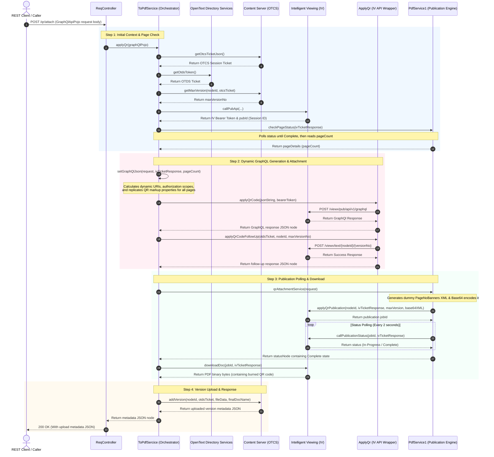

# Operational Flow & Exception Handling: `/qr/attach`

This document details the complete end-to-end execution flow and exception propagation system for the `/qr/attach` endpoint.

---

## 1. Process Flow Diagram (Boxes & Arrows)

This flowchart traces the step-by-step process of the `/qr/attach` endpoint, highlighting decision gates (diamonds), logical operations (rectangles), and the execution path.

```mermaid
graph TD
    %% Define Styles
    classDef startEnd fill:#E6F2FF,stroke:#0066CC,stroke-width:2px,rx:10px,ry:10px;
    classDef process fill:#FFF2CC,stroke:#D6B656,stroke-width:1.5px;
    classDef decision fill:#F8CECC,stroke:#B85450,stroke-width:1.5px;
    classDef exception fill:#FADBD8,stroke:#C0392B,stroke-width:1.5px,stroke-dasharray: 5 5;
    classDef success fill:#D5E8D4,stroke:#82B366,stroke-width:2px;

    %% Elements
    Start((Client calls POST /qr/attach)):::startEnd
    
    subgraph Step 1: Authentication & Node Metadata
        V1[Log Payload & Parse Json]:::process
        D1{JSON Valid?}:::decision
        Err1[Throw RuntimeException: 400 Bad Request]:::exception
        Auth1[Fetch OTDS Ticket & OTCS Session Ticket]:::process
        Ver1[Query OTCS for maxVersionNo of target Node]:::process
    end

    subgraph Step 2: Page Detection & Dynamic GraphQL Build
        IV1[Request IV Ticket & Session Token]:::process
        Page1[Check page count from IV publication artifact metadata]:::process
        LoopPages[Iterate through pages to dynamically map QR markup coordinates]:::process
        D2{isQrOnFirstPageOnly == true?}:::decision
        MapAll[Cloned Markups mapped to ALL pages]:::process
        MapFirst[Markup mapped to page 0 only]:::process
        BuildPayload[Serialize updated GraphQlApiPojo to JSON]:::process
    end

    subgraph Step 3: IV Workspace Image Attachment & Follow-Up
        Attach1[Post QR markup coordinates to IV GraphQL API]:::process
        Follow1[Send GraphQL Follow-up text update request with otdsTicket]:::process
    end

    subgraph Step 4: Publication & Download
        Pub1[Generate empty PageNoBanners XML template & Base64 encode it]:::process
        Pub2[Post applyQrPublication trigger to IV with PageNoBanners]:::process
        Poll1[Query IV Publication Status API]:::process
        D3{Status == Complete?}:::decision
        D4{Status == Failed?}:::decision
        Err2[Throw ExternalApiException: Job Failed]:::exception
        PollWait[Wait 2 Seconds]:::process
        Down1[Download PDF Binary Bytes from IV]:::process
    end

    subgraph Step 5: Version Upload
        U1[Upload PDF to OTCS as New Version under finalDocName]:::process
        U2[Return uploaded node metadata to Controller]:::process
        EndResponse((Return 200 OK with metadata JSON)):::success
    end

    %% Flow Paths
    Start --> V1
    V1 --> D1
    D1 -- No --> Err1
    D1 -- Yes --> Auth1
    Auth1 --> Ver1
    Ver1 --> IV1
    IV1 --> Page1
    Page1 --> LoopPages
    LoopPages --> D2
    D2 -- Yes --> MapFirst --> BuildPayload
    D2 -- No --> MapAll --> BuildPayload
    BuildPayload --> Attach1
    Attach1 --> Follow1
    Follow1 --> Pub1
    Pub1 --> Pub2
    Pub2 --> Poll1
    
    Poll1 --> D3
    D3 -- No --> D4
    D4 -- Yes --> Err2
    D4 -- No --> PollWait --> Poll1
    D3 -- Yes --> Down1
    
    Down1 --> U1
    U1 --> U2 --> EndResponse

    %% Exception Handling Gateway
    subgraph Exception Handling Gateway
        Err1 & Err2 --> GlobalAdvice[GlobalExceptionHandler intercepts]:::exception
        GlobalAdvice --> LogErr[Log diagnostics context & target URL]:::exception
        LogErr --> FormatResponse[Generate sanitized JSON response with matching HTTP Code]:::exception
        FormatResponse --> ErrResponse((Return Client Error Response <br> 400 / 500 / 502)):::startEnd
    end
```

---

## 2. Happy Path Sequence Diagram

---

## 3. Step-by-Step Execution Mechanics

1. **Entry Point (`ReqController.java#attachQr`)**:
   - Exposes an HTTP `POST` mapping at `/qr/attach`.
   - Receives a `GraphQlApiPojo` body specifying the document target, the QR code image source node, and layout details.
   - Delegates execution to `toPdfSercice.applyQr(graphQlPojo)`.

2. **Authentication & Metadata Retrieval (`ToPdfSercice.java#applyQr`)**:
   - Authenticates using `otcsToken.getOtcsTicketJson()` and `otdsToken.getOtdsToken()` to retrieve tickets.
   - Fetches the highest current document version of the target node in Content Server via `allVersions.getMaxVersion`.
   - Obtains a rendering session ticket and bearer token from Intelligent Viewing (IV) using `iVTicket.callPubApi`.

3. **Page Count Extraction (`ToPdfSercice.java#applyQr`)**:
   - Invokes `checkPageStatus` which polls until the document page analysis is ready.
   - Reads the exact `pageCount` of the document dynamically from the artifact content JSON structure.

4. **Dynamic Markup Mapping (`ToPdfSercice.java#setGraphQlJson`)**:
   - Reads user ID, constructs the QR code URI (`/nodes/{imgNodeId}/versions/{imgVersion}/content`), and extracts publication details.
   - Checks if `isQrOnFirstPageOnly` is true. If yes, it maps the QR markup payload exclusively to page `0`. 
   - Otherwise, it replicates/clones the markup coordinates across all pages of the document (`0` to `pageCount - 1`).

5. **IV Workspace Update (`ApplyQr.java`)**:
   - Invokes `applyQrCode` to POST the JSON payload to the IV GraphQL endpoint (`/api/v1/graphql`).
   - Invokes `applyQrCodeFollowUp` to send a POST request with the placeholder text payload to `/api/v1/viewx/text/{nodeId}/{versionNo}` to commit the layout modification inside the IV workspace.

6. **Publication Pipeline (`PdfService1.java#qrAttachmentService`)**:
   - Since no visual text banner is required for this operation, the service generates a placeholder `PageNoBanners` XML template configured for 0 pages, converts it to base64, and initiates the publication process in IV via `publication.applyQrPublication`.
   - Polls the job status every 2 seconds via `checkStatus`.

7. **Download & Upload Version (`ToPdfSercice.java#applyQr`)**:
   - Once complete, it downloads the compiled PDF document bytes from the IV API containing the burned QR code.
   - Commits the updated PDF back to the Content Server as a new version under the name specified by `finalDocName` via `addVersion.addVersion`.

---

## 4. Exception Handling & Propagation Details

### Downstream Error Translation Flow
1. **Downstream API Failures**:
   - OKHttp clients intercept HTTP responses. If a request is not successful (status code is not in the 2xx range), the code extracts the raw error body.
2. **Exception Construction**:
   - An `ExternalApiException` is raised containing the status code, contextual action name (e.g. `"QR Attachment"`), and the targeted URL.
3. **Global Advice Mapping (`GlobalExceptionHandler.java`)**:
   - The `@ExceptionHandler` catches the `ExternalApiException`, formats a sanitized JSON response payload indicating which phase (such as OTCS upload, IV GraphQL attachment, or status polling) failed, and responds to the REST client with the corresponding HTTP code.
