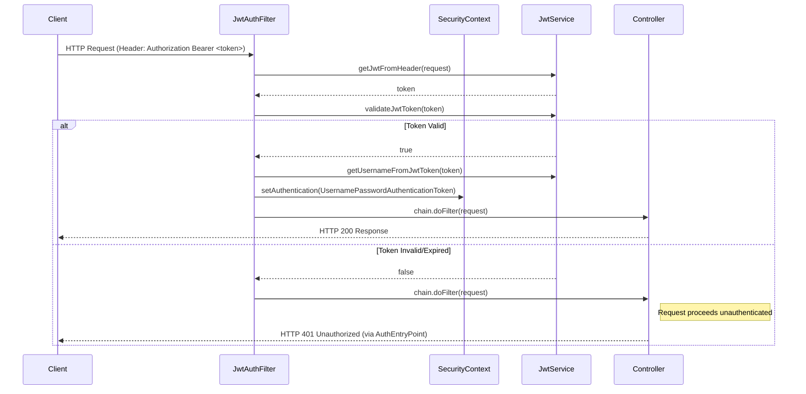

# Low Level Design: Spring Security Project

## 1. Architecture Overview

The project follows a **Feature-Based MVC (Vertical Slice)** architecture. Instead of layering by technical concern (Controller, Service, Repository), the application is sliced by business feature. This ensures high cohesion, low coupling, and scalability.

### High-Level Structure
- **`com.app.security`**: Root package.
    - **`jwt`**: Self-contained module for JWT authentication.
    - **`oauth`**: Self-contained module for OAuth2 authentication (in progress).
    - **`config`**: Shared configurations (Security, Database).
    - **`handler`**: Global exception handlers.

---

## 2. Component Design

### 2.1 Core Security Configuration
**Class**: `com.app.security.config.SecurityConfig`

- **Purpose**: Central security configuration.
- **Key Beans**:
    - `SecurityFilterChain`: Configures HTTP security, session management (Stateless), and exception handling.
    - `JwtAuthFilter`: Custom filter injected before `UsernamePasswordAuthenticationFilter` to validate JWTs on each request.
    - `UserDetailsService`: Uses `JdbcUserDetailsManager` to load users from the database.
    - `PasswordEncoder`: Uses `BCryptPasswordEncoder`.
- **Access Control**:
    - Public: `/auth/login/token`, `/auth/register`, `/auth/refreshtoken/**`
    - Protected: `/api/common`
    - Role-based: `/api/user/**` (USER), `/api/admin/**` (ADMIN)

### 2.2 JWT Feature
**Package**: `com.app.security.jwt`

#### Controller Layer
**Class**: `AuthController`
- **Location**: `com.app.security.controller.AuthController`
- **Endpoints**:
    - `POST /auth/login/token`: Login (returns JWT + Refresh Token).
    - `POST /auth/login/refreshtoken`: Generates a new access token using refresh token.
    - `POST /auth/refresh-token-cookie`: Generates a new access token using refresh token from cookie.
    - `POST /auth/register`: User registration.
    - `POST /auth/refreshtoken/revoke`: Logout (Revoke token).

#### Service Layer
**Interface**: `JwtService`
**Implementation**: `JwtServiceImpl`
- **Dependencies**: `JwtProperties`
- **Responsibilities**:
    - `generateTokenFromUsername(UserDetails)`: Creates signed JWTs.
    - `validateJwtToken(String)`: Verifies signature and claims.
    - `getJwtFromHeader(HttpServletRequest)`: Extracts "Bearer" token.
    - `getJwtFromHeader(HttpServletRequest)`: Extracts "Bearer" token.
    - `getUsernameFromJwtToken(String)`: Extracts subject (username).

#### Token Blacklist Service
**Interface**: `TokenBlacklistService`
**Implementation**: `TokenBlacklistServiceImpl`
- **Responsibilities**:
    - `blacklistToken(String token, long duration)`: Adds token to blacklist until expiry.
    - `isTokenBlacklisted(String token)`: Checks if a token is revoked.

### 2.3 Refresh Token Feature
**Package**: `com.app.security.refreshtoken`

#### Domain Layer
**Class**: `RefreshToken`
- **Attributes**: `id`, `token`, `username`, `expiryDate`, `createdAt`.
- **Usage**: Intended for persistence of long-lived refresh tokens.

#### Service Layer
**Implementation**: `RefreshTokenServiceImpl`
- **Responsibilities**:
    - `createRefreshToken(String username)`: Creates and persists a token.
    - `findByToken(String token)`: Retrieves token.
    - `verifyExpiration(RefreshToken token)`: Checks if token is expired.
    - `deleteByUserId(String username)`: Core logout logic.

### 2.4 OAuth2 Feature
**Package**: `com.app.security.oauth`

- **Components**:
    - `OAuth2UserService`: Logic to process user data from providers (Google, GitHub, etc.).
    - `OAuth2LoginSuccessHandler`: Intercepts successful logins, generates tokens, and **redirects** to frontend with tokens in URL parameters.
    - `OAuth2User`: Entity to map external provider IDs to internal users.
    - `OAuth2Config`: Configures OAuth2 using the `Customizer` pattern.

---

## 3. Sequence Diagrams

### 3.1 Authentication Flow (JWT)

---

## 4. Database Schema

### 4.1 User Management (Standard Spring Security JDBC)
The application uses the default Spring Security JDBC schema (`JdbcUserDetailsManager`).

| Table | Column | Type | Constraints |
|-------|--------|------|-------------|
| **users** | username | VARCHAR(50) | PK |
| | password | VARCHAR(500) | NOT NULL |
| | enabled | BOOLEAN | NOT NULL |
| **authorities** | username | VARCHAR(50) | FK -> users(username) |
| | authority | VARCHAR(50) | (Role/Permission) |

### 4.2 Refresh Tokens
Used for persistent sessions without keeping long partial access.

| Table | Column | Type | Constraints |
|-------|--------|------|-------------|
| **refresh_tokens** | id | BIGINT | PK, Auto Inc |
| | token | VARCHAR | Unique, Not Null |
| | username | VARCHAR | Not Null |
| | expiry_date | TIMESTAMP | Not Null |
| | created_at | TIMESTAMP | Not Null |

### 4.3 OAuth2 Users

| Table | Column | Type | Constraints |
|-------|--------|------|-------------|
| **oauth2_users** | id | BIGINT | PK, Auto Inc |
| | provider | VARCHAR | (e.g., 'GOOGLE') |
| | provider_id | VARCHAR | External User ID |
| | email | VARCHAR | Unique, Not Null |
| | name | VARCHAR | User's full name |

### 4.4 Token Blacklist
Used for revoking JWTs before they expire (Logout).

| Table | Column | Type | Constraints |
|-------|--------|------|-------------|
| **token_blacklist** | id | BIGINT | PK, Auto Inc |
| | token | VARCHAR | Unique, Not Null |
| | expiry_date | TIMESTAMP | Not Null |

---

## 5. Security & Configuration Properties

### `JwtProperties`
Mappings from `application.yml` (`spring.app` prefix).
- `jwtSecret`: HMAC SHA-Key (Base64 encoded).
- `jwtExpirationMs`: Access token lifespan.
- `jwtRefreshExpirationMs`: Refresh token lifespan.

### `SecurityConfig`
- **Session**: `STATELESS` (REST API best practice).
- **CSRF**: Disabled (not needed for stateless JWT APIs).
- **CORS**: Not explicitly configured (defaults apply, may need config for frontend integration).

