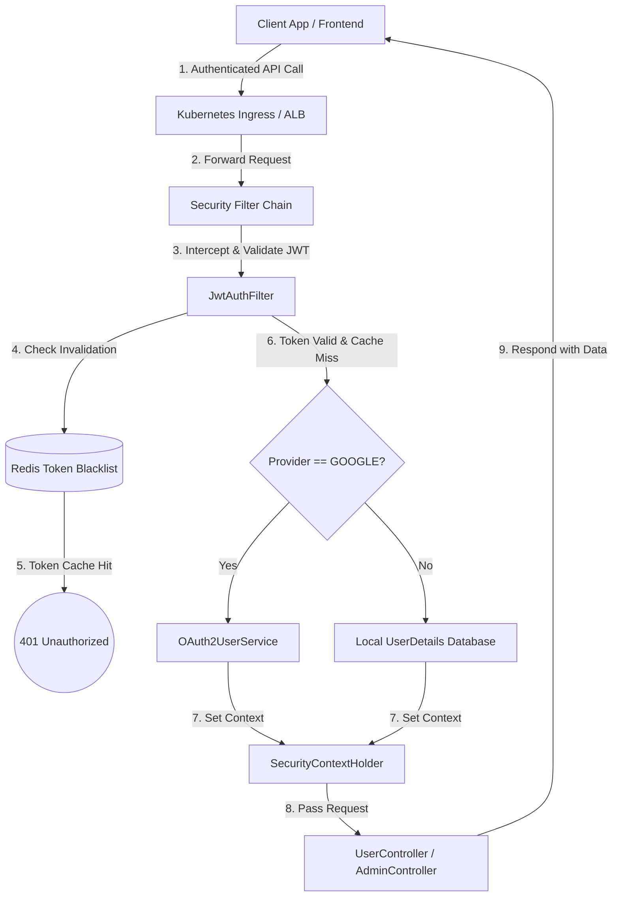
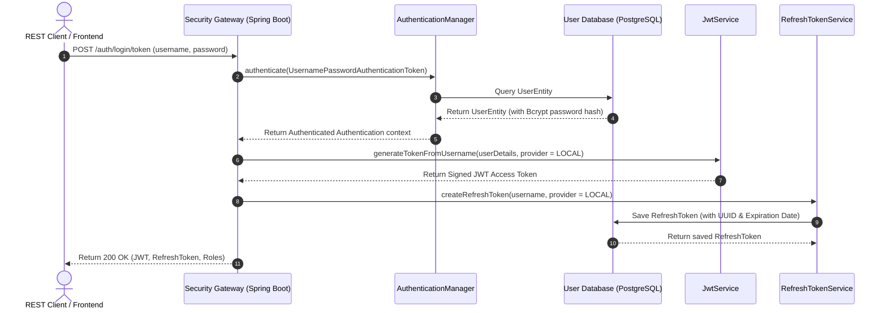
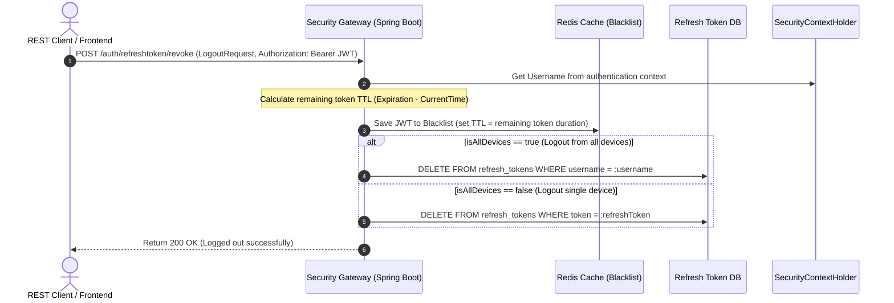

# Interview Preparation: Spring Security, JWT & OAuth2 Gateway
## (Enterprise Security, Identity & Access Management Edition)

This guide prepares you to discuss the **2_SpringSecurity** (SpringSecutiryNew) project in interviews for a **3+ Years of Experience** developer role. It highlights high-level security architecture patterns, JWT blacklisting, refresh token rotation, OAuth2 SSO integration, and secure REST filters.

---

## 1. Technological Stack & Tools Specification

To build a production-grade identity and access management (IAM) server, we utilized the following tools:

*   **Backend Framework**: **Java 17** & **Spring Boot 3.x** with **Spring Security 6.x** (stateless filters, method-level security).
*   **Database Integration**: **Spring Data JPA** with **PostgreSQL** (running inside a Docker container) for database persistence of users, refresh tokens, and blacklisted logout tokens.
*   **Security Token Standards**: **JSON Web Tokens (JWT)** via `io.jsonwebtoken` (jjwt) for stateless session generation.
*   **Identity Providers (SSO)**: **Spring Security OAuth2 Client** mapping login success hooks directly with Google OAuth2 APIs.
*   **Caching & Blacklisting**: **Redis Cache** (configured with a Reactive Redis Template) to cache blacklisted JWT tokens for stateless logouts.
*   **Testing Suite**: **JUnit 5** & **Mockito** with **Spring Security Test** to validate security mock filter chains.
*   **Containerization & Deployment**: **Docker Compose** orchestrating PostgreSQL and the Spring app, running on **Kubernetes** with secure SSL/TLS terminations.
*   **Observability**: Centralized application logging via **SLF4J + Logback** integrated with **Splunk** for tracing auth failures.

---

## 2. High-Level Design (HLD) & Security Architecture

The system is designed as a **Stateless Authentication Gateway** providing REST endpoints for local registration, JWT verification, token rotation, and single-sign-on (SSO) OAuth2 redirect handlers.

### Key Architectural Patterns
1.  **Stateless Session Policy**: Configured `SessionCreationPolicy.STATELESS` in Spring Security. This prevents the server from creating `JSESSIONID` cookies, enabling the backend to scale horizontally across Kubernetes pods without sticky sessions.
2.  **Stateless Logout with Token Blacklisting**: In standard JWT architectures, tokens cannot be invalidated until they expire. I implemented a **Token Blacklist Service** powered by **Redis**. When a user logs out, the access token is added to Redis with a TTL matching the token's remaining lifespan. The security filter rejects any subsequent requests using that token.
3.  **Refresh Token Rotation (RTR)**: Implemented secure refresh token rotation stored in the database. When the client requests a new JWT using a refresh token, the old refresh token is verified, and a new JWT is returned. 
4.  **Multi-Provider User Mapping (Google & Local)**: Integrates social login (Google OAuth2) and local email/password login. A single User Entity table binds multiple login credentials, storing `provider` details (LOCAL or GOOGLE).

---

## 3. Core API Flows (Sequencing)

### A. Authentication & Session Generation (`POST /auth/login/token`)
Validates user credentials against the database, generates a stateless JWT containing user details and authorization scopes, creates a database-backed refresh token, and returns them to the caller.

---

### B. Access Token Invalidation & Logout (`POST /auth/refreshtoken/revoke`)
Logs the user out by blacklisting their access token in Redis and removing their refresh token from the database, supporting single-device or all-devices logout.

---

## 4. Key Performance and Resilience Strategies (3+ Years Level)

1.  **JWT Verification Optimization**:
    - Kept verification key checking lightweight. Verified signatures locally using asymmetric keys (HMAC SHA-512) without querying the database for every request.
2.  **Redis Cache Integration**:
    - Used Redis to cache invalid tokens. Reading from Redis takes < 2ms, meaning checking if a token is blacklisted in our filter chain (`OncePerRequestFilter`) adds negligible overhead to the API.
3.  **Method-Level Authorization**:
    - Used Spring Security's `@EnableMethodSecurity` to declare role-based access control directly on REST controllers using `@PreAuthorize("hasRole('ADMIN')")`, keeping access rules declarative and clean.
4.  **Bcrypt Work Factor Tuning**:
    - Configured `BCryptPasswordEncoder` with a strength factor of 10 to balance password hashing security with server CPU cycles, preventing resource exhaustion during login spikes.
