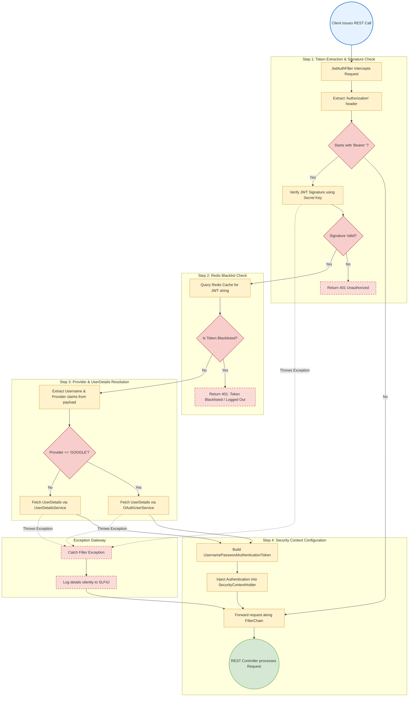
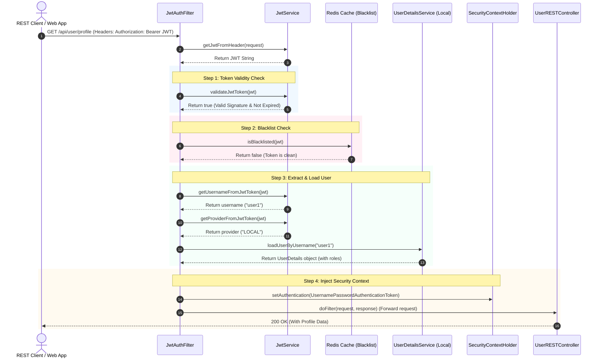

# Operational Flow & Exception Handling: JWT Filter & Invalidation

This document details the complete end-to-end execution flow and exception propagation system for JWT request authentication and token invalidation (blacklist) check.

---

## 1. Process Flow Diagram (Boxes & Arrows)

This flowchart traces the step-by-step process of the `JwtAuthFilter` interceptor, highlighting Redis blacklist verification, provider resolution, and context configuration.

---

## 2. Happy Path Sequence Diagram

---

## 3. Step-by-Step Execution Mechanics

1. **Request Interception (`OncePerRequestFilter`)**:
   - Every incoming HTTP call hits the `JwtAuthFilter#doFilterInternal` interceptor before reaching Spring's route mappings.
   - It checks the request headers for an `Authorization` key starting with `Bearer `.

2. **Validation & Blacklist Check**:
   - If a token is present, the key signature is validated using the application's HMAC SHA-512 signing secret key.
   - Checks if the token is registered in the Redis cache. If yes, it indicates the user has logged out. The filter short-circuits the request chain immediately, returning a `401 Unauthorized` status.

3. **Provider Resolution**:
   - Parses the token claims to retrieve the `username` and `provider` (e.g. `GOOGLE` vs `LOCAL`).
   - If the provider is `GOOGLE`, it loads the user profile via `oauth2UserService.loadUserByEmail`.
   - If local, it loads the profile via the default `userDetailsService.loadUserByUsername`.

4. **Security Context Updates**:
   - Builds a `UsernamePasswordAuthenticationToken` using the UserDetails entity and their list of roles/authorities.
   - Sets request details (IP, session info) and stores the authentication token in the `SecurityContextHolder`.
   - Calls `filterChain.doFilter(request, response)` to pass the request to the rest of the application.

---

## 4. Exception Handling & Silent Propagation

### Silent Filter Propagation
- Any exception occurring inside the validation filter (such as parser issues, malformed tokens, or expired JWT errors) is caught within a `try-catch` block inside the filter.
- Instead of crashing the request or breaking the filter chain, the filter logs the exception details silently (`log.error("Cannot set user authentication: ...")`).
- The security context remains empty. The request continues down the filter chain to Spring Security's authorization filters (like `FilterSecurityInterceptor`), which block the request and return a structured `401 Unauthorized` response via `AuthEntryPoint`.
