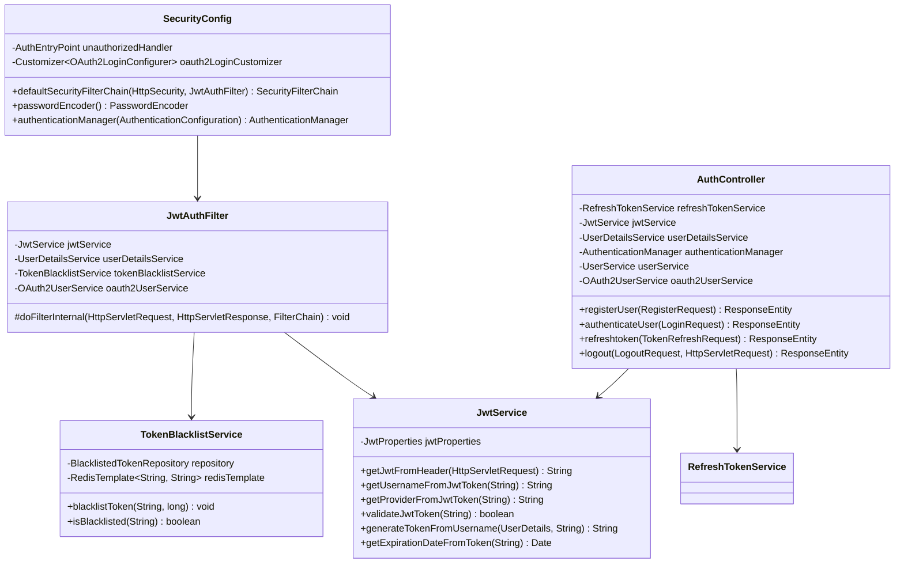

# Low-Level Design (LLD): Spring Security, JWT & OAuth2
## (Production-Ready Architecture Edition)

This document describes the Low-Level Design (LLD) of the **SpringSecutiryNew** security gateway. It covers class specifications, package layouts, filter configurations, DTO structures, and JPA schemas.

---

## 1. Class Structure & Filter Chain Dependencies

Incoming REST requests pass through a series of Spring Security filters before reaching the controllers. The custom `JwtAuthFilter` checks the Redis blacklist and resolves security context.

---

## 2. Core Security Classes & Filter Mappings

### A. Filter Chain Configuration

#### `SecurityConfig`
Defines authorization rules and registers JWT filters.
*   **Security Filter Chain**:
    - Disables CSRF.
    - Configures `SessionCreationPolicy.STATELESS`.
    - Declares endpoint permissions:
      - `/auth/login/token`, `/auth/login/refreshtoken`, `/auth/register`: `permitAll()`
      - `/api/admin/**`: `hasRole('ADMIN')`
      - `/api/user/**`: `hasRole('USER')`
      - All other endpoints: `authenticated()`
    - Configures custom OAuth2 Login redirects.
    - Registers `JwtAuthFilter` before `UsernamePasswordAuthenticationFilter`.

---

### B. JWT & Token Validation Layers

#### `JwtAuthFilter` (extends `OncePerRequestFilter`)
Intercepts each request to validate the JWT token.
*   *Method*: `doFilterInternal(...)`:
    - Reads the request's Authorization header to extract the JWT.
    - Checks if the token is blacklisted using `tokenBlacklistService.isBlacklisted(jwt)`. If yes, returns a `401 Unauthorized` status.
    - Reads the `username` and `provider` (LOCAL/GOOGLE) claims from the token.
    - Resolves the matching `UserDetails` object.
    - Builds a `UsernamePasswordAuthenticationToken` context and saves it in `SecurityContextHolder.getContext().setAuthentication(...)`.
    - Hands execution over to the next filter in the chain.

#### `TokenBlacklistService`
Handles JWT revocation upon user logout.
*   *Methods*:
    - `blacklistToken(String token, long durationMs)`: Saves the JWT token in Redis with a TTL matching the token's remaining lifespan.
    - `isBlacklisted(String token)`: Checks if the token exists in Redis.

---

### C. Refresh Token Details (`com.app.security.refreshtoken`)

#### `RefreshToken` (JPA Entity mapped to `refresh_tokens` table)
Stores refresh tokens used for session rotation.
*   **Attributes**:
    - `id`: `Long` (Primary Key)
    - `token`: `String` (Unique UUID)
    - `username`: `String` (Owner's username)
    - `expiryDate`: `Instant` (Expiration timestamp)
    - `provider`: `String` (LOCAL / GOOGLE)

#### `RefreshTokenService`
*   *Methods*:
    - `createRefreshToken(String username, String provider)`: Generates a new random UUID token, sets its expiry (e.g. 7 days), saves it in PostgreSQL, and returns it.
    - `verifyExpiration(RefreshToken token)`: Validates that the token's expiration date is in the future. If expired, deletes it from the database and throws a `TokenRefreshException`.
    - `deleteByUserId(String username)`: Deletes all active refresh tokens for a user, effectively logging them out of all devices.
