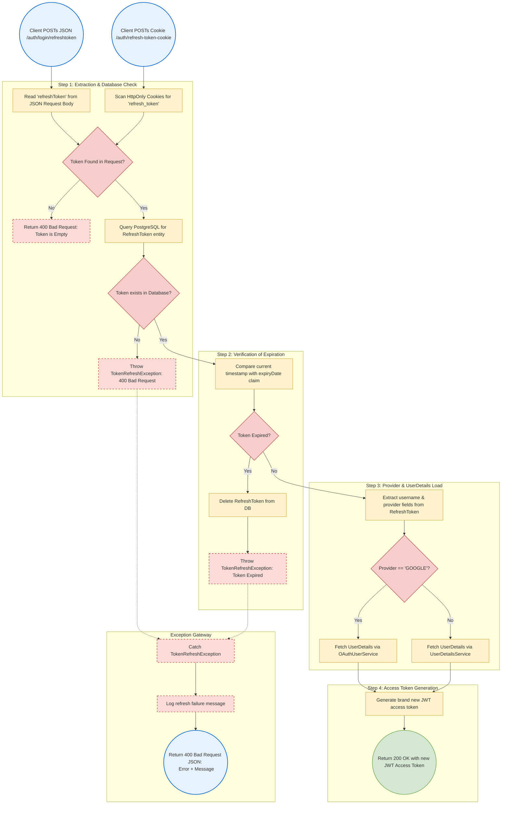
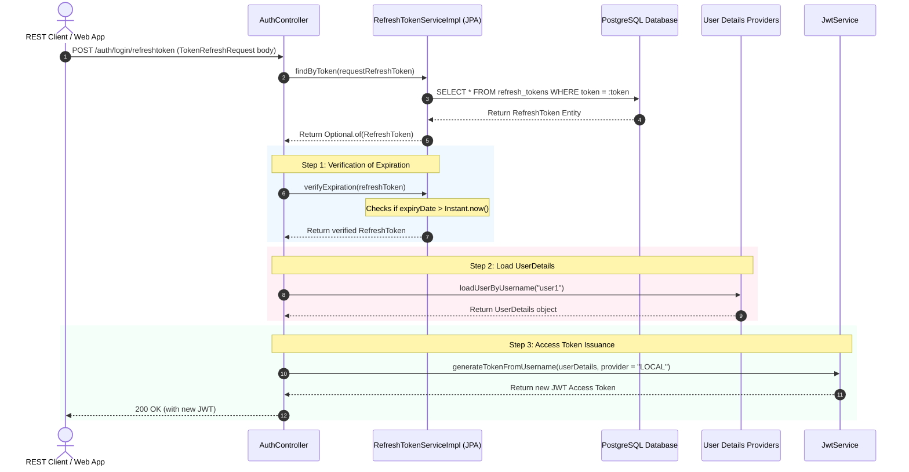

# Operational Flow & Exception Handling: Refresh Token & Cookie Integration

This document details the complete end-to-end execution flow and exception propagation system for the token refresh pipelines (both JSON payload-based and secure HttpOnly cookie-based).

---

## 1. Process Flow Diagram (Boxes & Arrows)

This flowchart traces the step-by-step process of the token refresh endpoints, highlighting database checking, expiration validation, and security exception gates.



---

## 2. Happy Path Sequence Diagram



---

## 3. Step-by-Step Execution Mechanics

1. **Extraction & DB Fetching**:
   - The user triggers refresh using either payload extraction (`/auth/login/refreshtoken`) or browser cookies extraction (`/auth/refresh-token-cookie`).
   - The system queries PostgreSQL to retrieve the `RefreshToken` matching the token UUID.
   - If the token does not exist in the database, a `TokenRefreshException` is thrown.

2. **Expiration Validation**:
   - Compares the `expiryDate` attribute against the current system timestamp.
   - If the current time is greater than the expiry time, the token is expired. The system immediately deletes the token record from PostgreSQL (`refreshTokenRepository.delete(...)`) to prevent reuse, and throws a `TokenRefreshException`.

3. **User Loading**:
   - Reads the token's associated `username` and login `provider` attributes.
   - Loads the user profile from the database (`userDetailsService`) or the OAuth mapping provider (`oauth2UserService`).

4. **Token Generation**:
   - Passes the UserDetails context to `jwtService.generateTokenFromUsername` to sign a new access token.
   - Returns the new JWT access token to the client.

---

## 4. Exception Handling & Controller Advice Mapping

### Global Exception Boundary Mapping
- Custom exceptions (specifically `TokenRefreshException`) are handled by Spring's `@RestControllerAdvice` in `GlobalExceptionHandler.java`.
- When a `TokenRefreshException` is thrown, the advice intercepts the request, blocks downstream propagation, logs the failure, and returns a structured JSON payload:
  ```json
  {
    "message": "Failed to refresh token: [Details of error]",
    "status": false
  }
  ```
  This is returned to the client with an HTTP status of `400 Bad Request`, preventing raw stack traces from exposing database details.
