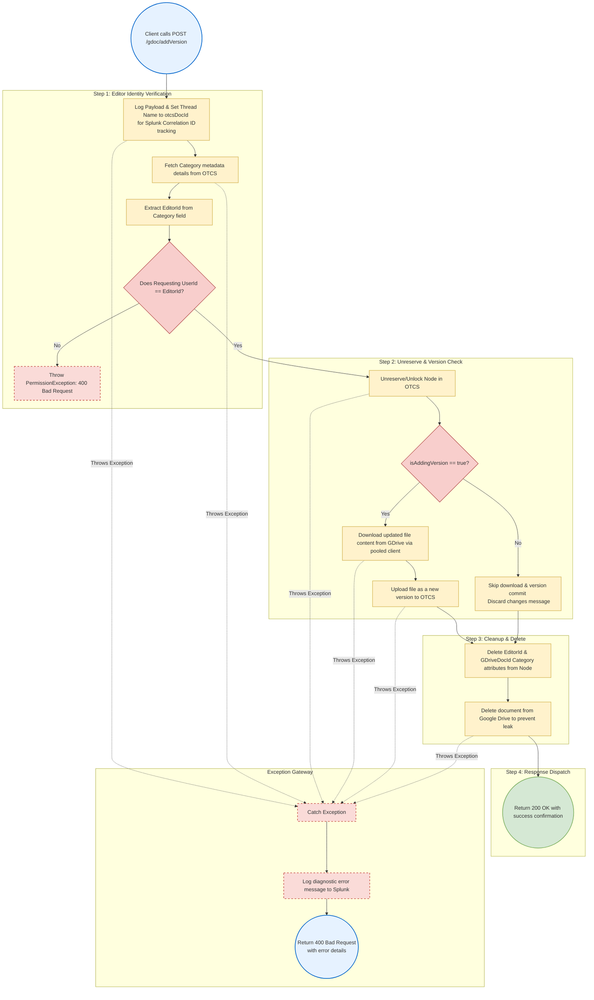
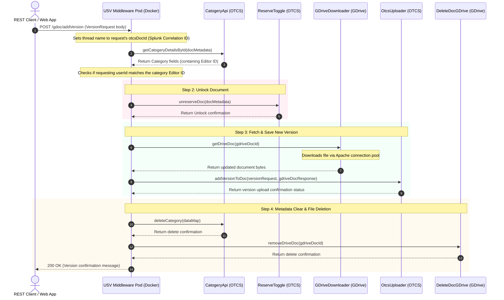

# Operational Flow & Exception Handling: `/gdoc/addVersion`

This document details the complete end-to-end execution flow and exception propagation system for the `/gdoc/addVersion` endpoint.

---

## 1. Process Flow Diagram (Boxes & Arrows)

This flowchart traces the step-by-step process of the `/gdoc/addVersion` endpoint, highlighting decision gates (diamonds), logical operations (rectangles), and the execution path.

---

## 2. Happy Path Sequence Diagram

---

## 3. Step-by-Step Execution Mechanics

1. **Entry Point (`ReqController.java#addVersion`)**:
   - Listens on `POST` requests at `/gdoc/addVersion`.
   - Modifies the execution thread name temporarily to `request.getOtcsDocId()` to track metrics (Correlation ID in Splunk/ELK).
   - Invokes `usvService.addVersionToDoc(request)`.

2. **Verify Editor ID (`UsvService.java#addVersionToDocument`)**:
   - Queries the document metadata from OTCS via `catogeryApi.getCatogeryDetailsById` to read the `EditorId` attribute.
   - Evaluates the Editor ID against the requesting user ID.
   - If they do **not** match, it blocks execution, logs a warning, and returns a `400 Bad Request` containing a `PermissionException` message.

3. **Unlock Document (`UsvService.java#addVersionToDocument`)**:
   - Releases the reservation lock on Content Server by executing `reserveToggle.unreserveDoc`.

4. **Add Version or Discard Changes**:
   - **Scenario A: `addingVersion` is True (Check-in edits)**:
     - Downloads the modified document version from Google Drive via `gdriveDownloader.getDriveDoc` (making a pooled HTTP connection).
     - Commits the downloaded document bytes as a new version on Content Server via `otcsUploader.addVersionToDoc`.
   - **Scenario B: `addingVersion` is False (Discard edits)**:
     - Skips the Google download and version upload.
     - Logs a discard action and prepares a discard confirmation.

5. **Metadata Cleanup & Google File Deletion**:
   - Invokes `categoryApi.deleteCategory` to clear the `EditorId` and `GDriveDocId` category fields from the OTCS node.
   - Invokes `deleteDocGDrive.removeDriveDoc` to delete the temporary document from Google Drive to satisfy data residency requirements.
   - Returns the confirmation response.

---

## 4. Exception Handling & Propagation Details

### Downstream Error Translation
1. **Downstream API Failures**:
   - HTTP clients capture non-2xx status codes (such as Google Drive access token expiration, network timeouts, or OTCS check-in failures).
2. **Controller Level Try-Catch Wrapper**:
   - `UsvService.java#addVersionToDoc` handles execution errors within a `try-catch` block.
   - If any downstream API error occurs, the code catches the exception and returns the error message directly inside a `ResponseEntity` with a status of `400 Bad Request`.
