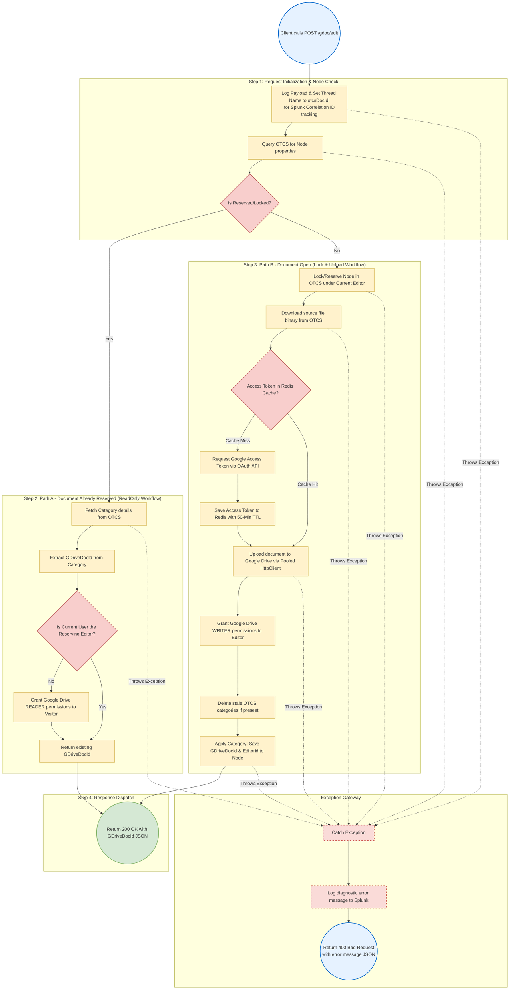
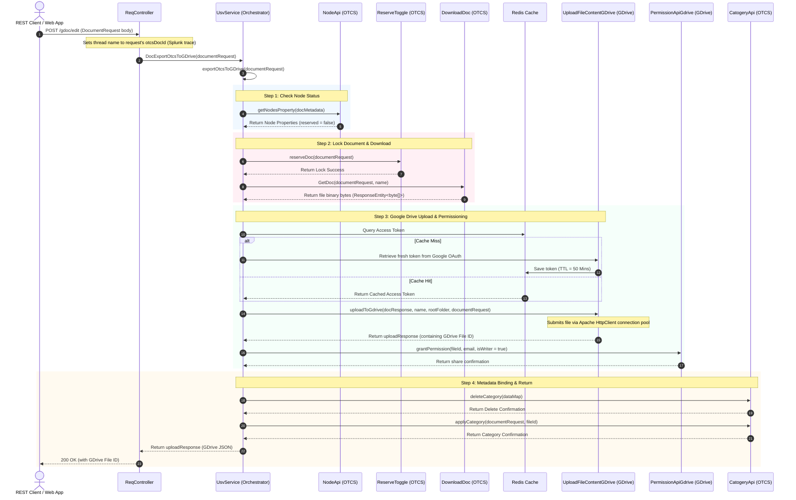

# Operational Flow & Exception Handling: `/gdoc/edit`

This document details the complete end-to-end execution flow and exception propagation system for the `/gdoc/edit` endpoint.

---

## 1. Process Flow Diagram (Boxes & Arrows)

This flowchart traces the step-by-step process of the `/gdoc/edit` endpoint, highlighting decision gates (diamonds), logical operations (rectangles), and the execution path.

---

## 2. Happy Path Sequence Diagram

---

## 3. Step-by-Step Execution Mechanics

1. **Entry Point (`ReqController.java#getDocumentById`)**:
   - Accepts a `POST` request at `/gdoc/edit` containing `DocumentRequest` parameters.
   - Modifies the execution thread name temporarily to `request.getOtcsDocId()` to assist in logging analysis (Correlation ID).
   - Delegates execution to `usvService.DocExportOtcsToGDrive(request)`.

2. **Check Reservation Status (`UsvService.java#exportOtcsToGDrive`)**:
   - Queries the document metadata from OTCS via `nodeApi.getNodesProperty` to retrieve `reserved` (boolean) status and the lock owner (`reserved_user_id`).
   - Sets the local filename using the retrieved properties.

3. **Check-out Strategy - Branching Execution**:
   - **Scenario A: The Document is Reserved (Locked)**:
     - Fetches existing category details on Content Server using `catogeryApi.getCatogeryDetailsById`.
     - Extracts the `gdriveDocId` stored under the designated category field ID.
     - Checks if the user requesting the edit matches the reserving user. If they do **not** match, it executes `permissionApiGdrive.grantPermission` to dynamically assign a reader role (`isWriter = false`) to the new visitor's email.
     - Directly returns the existing `gdriveDocId` to the client.
   - **Scenario B: The Document is Open (Available)**:
     - Issues a lock command via `reserveToggle.reserveDoc` to lock the document in OTCS.
     - Downloads the file binary content from Content Server using `downloadDoc.GetDoc`.
     - Queries Redis for the Google Access Token; if expired or not present, it fetches a new token from Google OAuth and caches it in Redis with a 50-minute TTL.
     - Uploads the downloaded document to Google Drive under the defined workspace folder via `uploadFileContentGDrive.uploadToGdrive` using pooled HTTP connections.
     - Grants edit permissions (`role: writer`) to the editor's email via `permissionApiGdrive.grantPermission(..., true)`.
     - Wipes any stale categories and applies fresh attributes storing `GDriveDocId` and the editor's `userId` onto the OTCS node via `categoryApi.applyCategory`.
     - Returns the new Google Drive File ID to the client.

---

## 4. Exception Handling & Propagation Details

### Downstream Error Translation
1. **Downstream API Exception Catching**:
   - Client wrappers (`CallingOtcsApi`, `CallingGDriveApi`) monitor HTTP requests.
   - If REST requests return non-2xx status codes (such as a 403 Forbidden or 404 Not Found), custom exception handlers wrap the response.
2. **Global Controller Level Wrapper**:
   - `UsvService.java#DocExportOtcsToGDrive` surrounds execution with a `try-catch` block.
   - If any exception is thrown (e.g., `IllegalClientSecretException` or `PermissionException`), the service catches the error, parses the details into a standard JSON message body using `jsonObj.getJson`, and returns it inside a `ResponseEntity` with an HTTP status of `400 Bad Request`.
