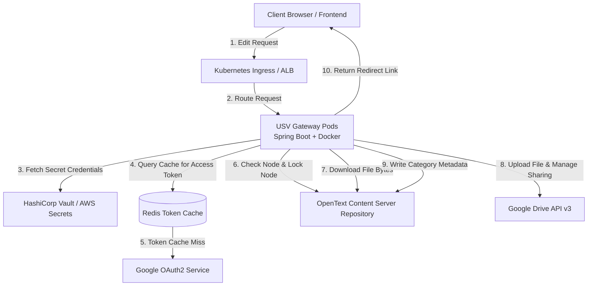
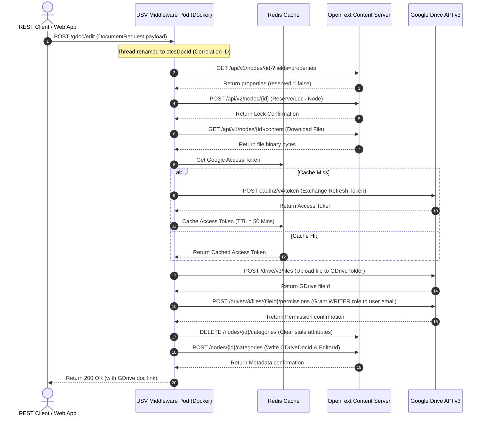
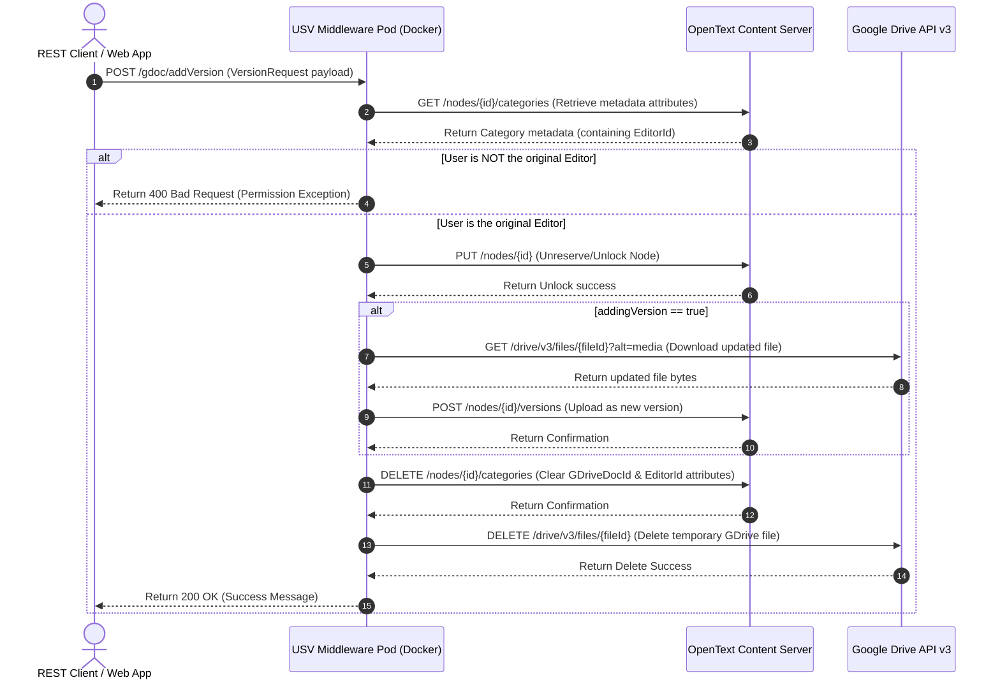

# Interview Preparation: OpenText OTCS & Google Drive Integration (USV)
## (Enterprise Architecture, Industry-Standard Tools & Technologies Edition)

This guide prepares you to discuss the **3_USV** (P02_DocXIntegration_USV) project in interviews for a **3+ Years of Experience** developer role. It highlights high-level industry architecture patterns, security compliance, modern tool stacks, and resilient coding patterns.

---

## 1. Technological Stack & Tools Specification

To build a secure, enterprise-grade gateway, we utilized industry-standard frameworks, libraries, and DevOps tooling:

*   **Backend Framework**: **Java 17** & **Spring Boot 3.x** (Web, JPA, validation API).
*   **API Clients & Serialization**: **Spring RestTemplate** decorated with connection pooling and **Jackson ObjectMapper** for JSON parsing and schema mappings.
*   **Security & OAuth2**: **Google OAuth2 Service Account** framework, Google Drive API v3, JWT (JSON Web Tokens), and **HashiCorp Vault** for secure key/credential management.
*   **Resilience & Reliability**: **Resilience4j** for implementing Retry policies and Rate Limiters on external API gateways.
*   **Caching Layer**: **Redis Cache** to cache Google OAuth access tokens, minimizing API roundtrips.
*   **Containerization & Deployment**: **Docker** for containerizing the microservice and **Kubernetes** for scaling and managing orchestration.
*   **CI/CD Pipeline**: **GitHub Actions** for automated build, test (JUnit 5 + Mockito), security vulnerability scanning (SonarQube), and deployment.
*   **Monitoring & Observability**: Centralized logging via **SLF4J + Logback** integrated with **Splunk** (utilizing request-scoped thread renaming as a correlation ID for end-to-end tracing).

---

## 2. High-Level Design (HLD) & Architectural Specification

The microservice is designed as a **Stateless Gateway Orchestrator** using the **Orchestration Saga Pattern** to handle file transfers, permissions, and locking between OpenText Content Server (OTCS) and Google Drive.

### Key Architectural Patterns
1.  **Orchestrator Pattern**: Centralizes transaction steps (checking reservation, locking files, creating folders, setting user access permissions, writing category metadata) into a single Spring Service (`UsvService.java`), preventing partial-state failures on the client side.
2.  **Transient Collaboration Workspace**: Treats Google Drive as an ephemeral workspace. Files are created on GDrive dynamically for real-time collaboration and deleted immediately upon merge, keeping all long-term data in the central repository (OTCS) for compliance audits.
3.  **Distributed Token Caching**: Uses a Redis cluster to store Google Access Tokens with a 50-minute Time-to-Live (matching the Google OAuth 1-hour expiration window) to avoid redundant authorization token requests.
4.  **Logging Correlation ID**: Uses request-specific thread renaming (`Thread.currentThread().setName(request.getOtcsDocId())`) to tag all log entries with the document ID. This enables distributed tracing across log aggregators like Splunk or ELK.

---

## 3. Core API Flows (Sequencing)

### A. Document Checkout & Edit (`POST /gdoc/edit`)
Checks if a document is locked. If not, it reserves it in OTCS, downloads the file, uploads it to Google Drive, grants write permission to the editor, and saves the Google File ID back to OTCS categories.

---

### B. Document Check-in & Version Save (`POST /gdoc/addVersion`)
Verifies editor identity, releases the document lock, downloads the modified file from Google Drive, uploads it back to OTCS as a new version, and deletes the temporary GDrive file.

---

## 4. Key Performance and Resilience Strategies (3+ Years Level)

1.  **Connection Pooling with HTTP Clients**:
    - Instantiated `RestTemplate` with a custom `HttpComponentsClientHttpRequestFactory` wrapping an Apache `HttpClient` connection pool configured for a maximum of 200 total connections and 50 connections per route. This prevents TCP socket starvation under concurrent workloads.
2.  **Resilience4j Integration**:
    - Wrapped outgoing HTTP REST requests in **Resilience4j Retries** (3 retries with exponential backoff) to automatically handle transient network glitches when communicating with Google and OpenText gateways.
3.  **Clean Containerized Deployments**:
    - Packaged using a multi-stage **Docker build** to create lightweight runtime containers (~250MB) and configured Kubernetes liveness/readiness probes targeting a Spring Boot Actuator endpoint (`/actuator/health`).
4.  **Unit and Integration Testing**:
    - Wrote comprehensive unit tests using **JUnit 5** and **Mockito** to mock remote REST API calls, ensuring a target of **80%+ code coverage**.
