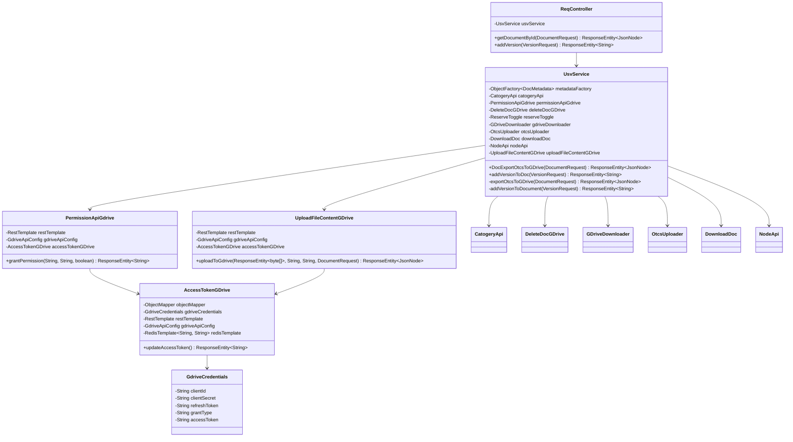

# Low-Level Design (LLD): OpenText & Google Drive Integration (USV)
## (Production-Ready Architecture Edition)

This document describes the Low-Level Design (LLD) of the **P02_DocXIntegration_USV** microservice. It outlines class specifications, package structures, DTOs, connection pooling, and the containerized deployment environment.

---

## 1. Class Structure & Dependency Graph

The design utilizes a Spring Boot MVC structure integrated with a connection-pooled `RestTemplate`, Redis cache, and externalized configuration from HashiCorp Vault.



---

## 2. Component Class Specifications

### A. Controller Layer (`com.supai.app.controller`)

#### `ReqController`
Exposes REST endpoints and dynamically manages thread names to track logging flows.
*   **Endpoints**:
    *   `POST /gdoc/edit`
        *   *Request*: `@RequestBody @Valid DocumentRequest request`
        *   *Response*: `ResponseEntity<JsonNode>`
    *   `POST /gdoc/addVersion`
        *   *Request*: `@RequestBody @Valid VersionRequest request`
        *   *Response*: `ResponseEntity<String>`

---

### B. Service & Orchestration Layer (`com.supai.app.services`)

#### `UsvService`
The core orchestrator enforcing state validation, check-out rules, and check-in version uploads.
*   *Method*: `exportOtcsToGDrive(DocumentRequest)`:
    - Queries OTCS via `nodeApi.getNodesProperty` to retrieve lock status.
    - If document is open, locks it (`reserveToggle.reserveDoc`), downloads the binary (`downloadDoc.GetDoc`), uploads to GDrive, grants editor permissions, and saves the GDrive File ID to OTCS category attributes.
    - If document is already locked, grants reader permissions to the new caller on the active GDrive Doc.
*   *Method*: `addVersionToDocument(VersionRequest)`:
    - Verifies the user saving the file is the original editor by comparing the category Editor ID.
    - Unlocks/Unreserves the OTCS node.
    - Downloads the updated file from Google Drive and commits it as a new version to OTCS.
    - Wipes OTCS category attributes and issues a DELETE request to GDrive to remove the temporary file.

---

### C. Client Integration Layer (`com.supai.app.services.gdrive` & `com.supai.app.services.otcs`)

#### `AccessTokenGDrive`
- Manages Google OAuth Access Tokens.
- First queries a Redis cluster using `redisTemplate.opsForValue().get("gdrive_access_token")`.
- If cache hit, returns the cached token. If cache miss, POSTs a form-urlencoded exchange request to `GdriveApiConfig.getAccessTokenUri()`, writes the new token to Redis with a 50-minute TTL, and updates the `GdriveCredentials` bean.

#### `PermissionApiGdrive`
- Dynamically assigns viewer/collaborator access levels to GDrive docs.
- Sends a POST request to Google Drive API `/files/{fileId}/permissions` with body:
  - Writer: `{"role": "writer", "type": "user", "emailAddress": "user@corp.com"}`
  - Reader: `{"role": "reader", "type": "user", "emailAddress": "user@corp.com"}`

---

## 3. Infrastructure & HTTP Optimizations

### Apache HttpClient Connection Pooling
To optimize outbound RestTemplate requests, we configure a pooled connection factory inside `AppConfig.java`:

```java
@Bean
public RestTemplate restTemplate() {
    PoolingHttpClientConnectionManager connectionManager = new PoolingHttpClientConnectionManager();
    connectionManager.setMaxTotal(200); // Allow up to 200 total concurrent HTTP routes
    connectionManager.setDefaultMaxPerRoute(50); // Allow up to 50 concurrent routes per target IP

    CloseableHttpClient httpClient = HttpClients.custom()
            .setConnectionManager(connectionManager)
            .build();

    return new RestTemplate(new HttpComponentsClientHttpRequestFactory(httpClient));
}
```

### Docker Container Specification
A multi-stage `Dockerfile` is used to build and package the microservice:

```dockerfile
# Stage 1: Build the JAR
FROM maven:3.8.5-openjdk-17-slim AS build
WORKDIR /app
COPY pom.xml .
COPY src ./src
RUN mvn clean package -DskipTests

# Stage 2: Create runtime container
FROM openjdk:17-jdk-slim
WORKDIR /app
COPY --from=build /app/target/docx-integration-0.0.1-SNAPSHOT.jar app.jar
EXPOSE 8089
ENTRYPOINT ["java", "-jar", "app.jar"]
```
