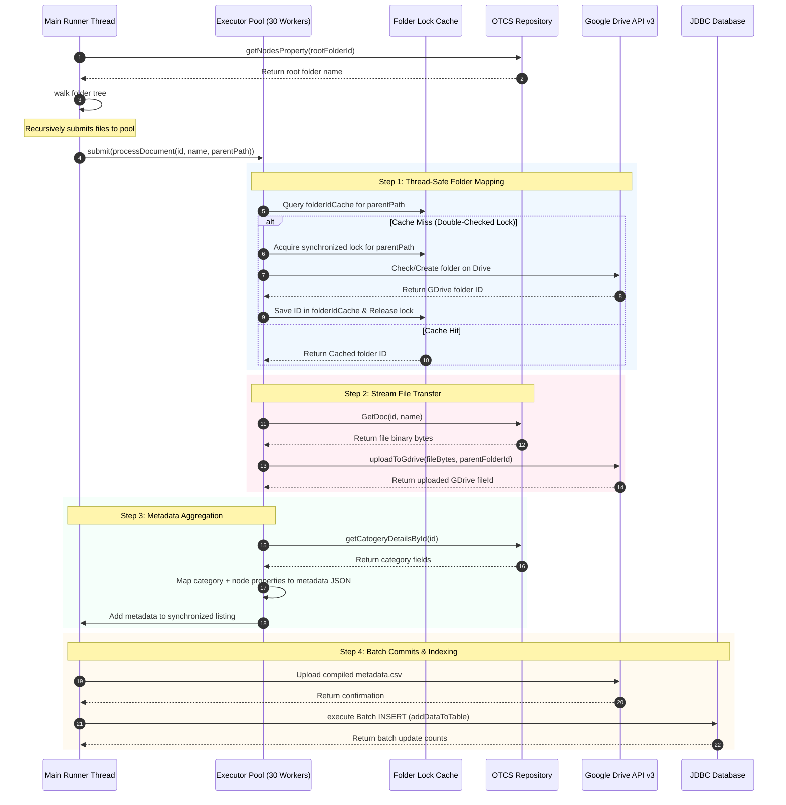

# Operational Flow & Exception Handling: Batch Migration

This document details the complete end-to-end execution flow and exception propagation system for the Multi-Threaded Batch Migration process.

---

## 1. Process Flow Diagram (Boxes & Arrows)

This flowchart traces the step-by-step process of the batch migration pipeline, highlighting directory recursion, thread pool scheduling, cache locking, and batch database loading.

```mermaid
graph TD
    %% Define Styles
    classDef startEnd fill:#E6F2FF,stroke:#0066CC,stroke-width:2px,rx:10px,ry:10px;
    classDef process fill:#FFF2CC,stroke:#D6B656,stroke-width:1.5px;
    classDef decision fill:#F8CECC,stroke:#B85450,stroke-width:1.5px;
    classDef exception fill:#FADBD8,stroke:#C0392B,stroke-width:1.5px,stroke-dasharray: 5 5;
    classDef success fill:#D5E8D4,stroke:#82B366,stroke-width:2px;

    %% Elements
    Start((Migration Job Triggered)):::startEnd
    
    subgraph "Step 1: Pre-Migration & Recursion"
        Init[Initialize Database Schema & Verify Columns]:::process
        Walk[Walk Directory Tree: Query OTCS Child Nodes]:::process
        D1{Is Subdirectory?}:::decision
        Recurse[Call folderIterator Recursively]:::process
        D2{Is Document Node?}:::decision
        SubmitPool[Submit Document Task to Executor Pool - 30 threads]:::process
    end

    subgraph "Step 2: Thread-Safe GDrive Folder Mapping"
        TaskStart[Worker Thread starts processDocument]:::process
        QueryCache{Is Parent Path Cached in folderIdCache?}:::decision
        GetLock[Acquire Lock for Path in folderLocks]:::process
        QueryCache2{Is Path Cached now?}:::decision
        CreateFolder[POST Create Folder to GDrive API v3]:::process
        SaveCache[Save GDrive Folder ID to Cache & Release Lock]:::process
    end

    subgraph "Step 3: Stream & Upload"
        Download[Download File bytes from OTCS]:::process
        Upload[Upload File content to target GDrive Folder]:::process
        MapMeta[Filter and map Category fields to JSON metadata]:::process
        StageMeta[Sync Stage: Add record to synchronized lists & CSV]:::process
    end

    subgraph "Step 4: Post-Migration Batch Commit"
        PoolWait[Wait for all threads to terminate: isTerminated]:::process
        D3{Staged metadata list not empty?}:::decision
        UploadCSV[Upload global metadata.csv to GDrive]:::process
        BatchDB[Execute Batch SQL INSERT into database]:::process
        EndResponse((Migration Finished Successfully)):::success
    end

    %% Flow Paths
    Start --> Init
    Init --> Walk
    Walk --> D1
    D1 -- Yes --> Recurse --> Walk
    D1 -- No --> D2
    D2 -- Yes --> SubmitPool
    
    %% Worker Execution
    SubmitPool --> TaskStart
    TaskStart --> QueryCache
    QueryCache -- Cache Hit --> Download
    QueryCache -- Cache Miss --> GetLock
    
    GetLock --> QueryCache2
    QueryCache2 -- Yes --> Download
    QueryCache2 -- No --> CreateFolder --> SaveCache --> Download
    
    Download --> Upload --> MapMeta --> StageMeta
    
    %% Synchronization point
    StageMeta --> PoolWait
    PoolWait --> D3
    D3 -- Yes --> UploadCSV --> BatchDB --> EndResponse
    D3 -- No --> EndResponse

    %% Exception Handling
    subgraph "Exception Gateway"
        Err[Catch Exception inside Worker Task]:::exception
        ErrLog[Write error diagnostic to ThreadLocal LogBuffer]:::exception
        ErrRelease[Release current locks & allow thread to terminate]:::exception
    end
    
    TaskStart & CreateFolder & Download & Upload -.->|Throws Exception| Err
    Err --> ErrLog --> ErrRelease
```

---

## 2. Happy Path Sequence Diagram

---

## 3. Step-by-Step Execution Mechanics

1. **Initialization (`App.java#run`)**:
   - Spawns the Spring Boot command-line program.
   - Triggers `otcsToGDriveService.exportOtcsToGDrive()`.

2. **Recursive Traversal (`OtcsToGDriveService.java#folderIterator`)**:
   - Recursively queries child nodes via `searchDocs.getChildNodes`.
   - If a node is a directory, it invokes `folderIterator` recursively, maintaining a path structure (e.g. `Root/FolderA/FolderB/`).
   - If a node is a file (`type == 144`), it submits a runnable task `processDocument` to the fixed thread pool (`ExecutorService` size 30).

3. **Thread-Safe GDrive Folder Mappings (`OtcsToGDriveService.java#processDocument`)**:
   - Uses **Double-Checked Locking** over path structures. Checks if the folder exists in the thread-safe `folderIdCache` map.
   - On cache miss, it synchronizes on a lock object specifically mapped to the directory path using `folderLocks.computeIfAbsent`.
   - Checks the cache a second time inside the synchronization block. If it is still missing, it makes the Google API call to verify/create the directory, saves the folder ID to `folderIdCache`, and releases the lock.

4. **File Streaming & Metadata Filtering**:
   - Downloads document bytes from Content Server via `downloadDoc.GetDoc`.
   - Streams the bytes to GDrive via `uploadFileContentGDrive.uploadToGdrive` using pooled connections.
   - Extracts categories, properties, and creator details via OpenText REST APIs.
   - Maps variables (e.g., Parent ID, Path, Created By, GDrive edit URL) into a combined JSON metadata schema.
   - Synchronizes on `csvContent` to append the record's metadata line, and inserts the JSON record into `jsonMetadataList`.

5. **Post-Migration Batch DB Commit**:
   - The main thread invokes `executorService.shutdown()` and blocks in a `while` loop until `isTerminated()` returns true, confirming all migrations are complete.
   - Combines the CSV content and uploads it to Google Drive as `metadata.csv`.
   - Calls `dbOperation.addDataToTable(jsonMetadataList)` to perform a high-performance **SQL Batch Insert** into the database using JDBC templates, completing the migration lifecycle.

---

## 4. Exception Handling & Propagation Details

### Thread-Isolated Exception Isolation
- Each `processDocument` task executes within its own thread context.
- To prevent a single document error from crashing the entire batch process, the runnable execution is fully isolated inside a `try-catch-finally` block:
  - If a file download, folder creation, or upload operation throws an exception, the thread catches the exception and prints the trace directly to a `ThreadLocal` `LogBuffer`.
  - In the `finally` block, the log buffer writes the complete, un-interleaved sequence to the logs, clears its buffer, and allows the worker thread to exit cleanly.
- The parent migration job completes with a summary of the successfully processed files and logged exceptions.
