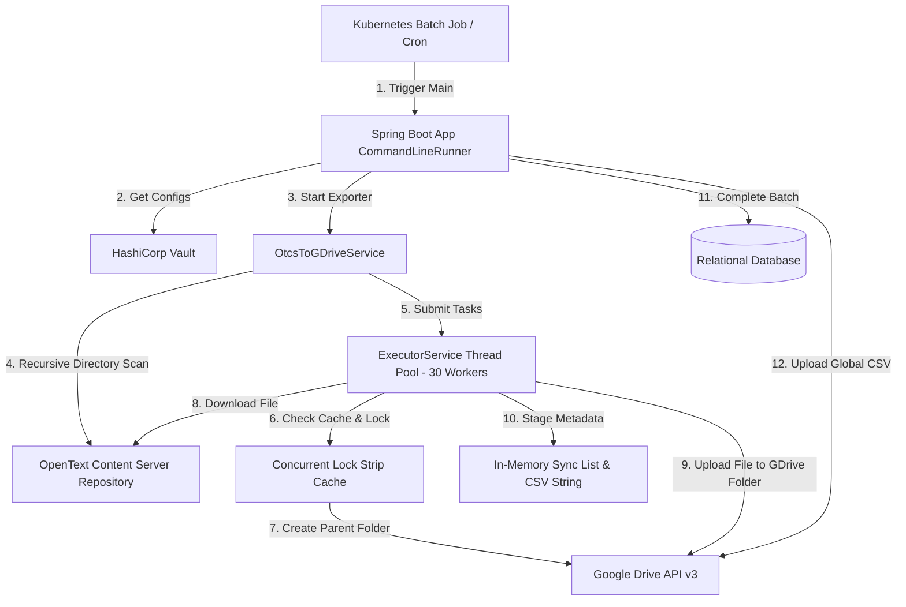
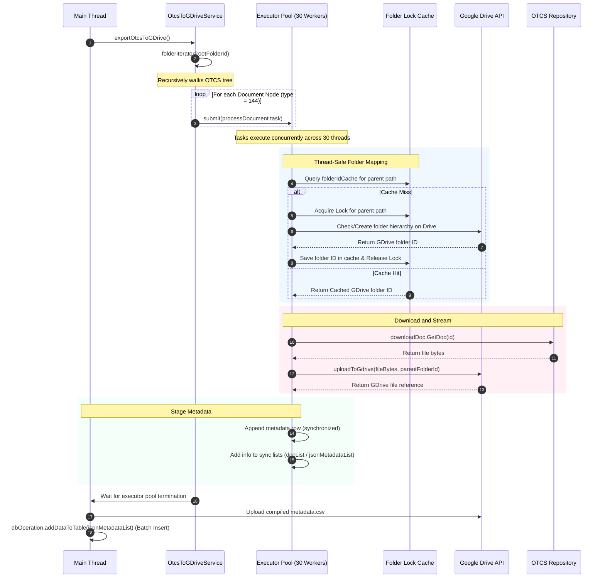

# Interview Preparation: OpenText to Google Drive Batch Exporter (AOL Export)
## (High-Concurrency Batch Migration & Metadata Ingestion Edition)

This guide prepares you to discuss the **4_OtcsToGdrive_AolExp_Dynamic_Col** (P01_OtcsToGdrive_AolExp_Dynamic_Col) project in interviews for a **3+ Years of Experience** developer role. It highlights high-concurrency patterns, metadata mapping, relational DB integration, and enterprise logging designs.

---

## 1. Technological Stack & Tools Specification

To build a high-throughput, secure batch migration gateway, we utilized the following production tools:

*   **Core Backend**: **Java 17** & **Spring Boot 3.x** (Core, JDBC, Validation).
*   **Database Integration**: **JDBC Template / Hibernate** for batch metadata insertion into Oracle, PostgreSQL, or MySQL databases.
*   **API Client**: Pooled **Spring RestTemplate** and Google API v3 Java libraries.
*   **Concurrency Utilities**: Java `ExecutorService` (Fixed Thread Pool), `ConcurrentHashMap` for lock stripping, and `AtomicInteger`.
*   **Secret Management**: **HashiCorp Vault** for database connection pools, credentials, and Google client secrets.
*   **Containerization & DevOps**: **Docker** multi-stage builds and **Kubernetes** batch jobs for scheduled migration workloads.
*   **CI/CD Pipeline**: **GitHub Actions** for CI testing (JUnit 5 + Mockito) and SonarQube quality checks.
*   **Centralized Logging**: **SLF4J + Logback** integrated with **Splunk** for thread-safe concurrent log aggregation.

---

## 2. High-Level Design (HLD) & Architectural Specification

The application is structured as a **High-Performance Batch Migration Worker** designed to run headlessly as a scheduled cron job or Kubernetes Job. It scans OpenText Content Server (OTCS), dynamically creates mapped directory hierarchies in Google Drive, migrates files concurrently, builds a global CSV metadata index, and loads the records in batch into a relational database.

### Component Roles & Responsibilities
*   **Orchestration Service (`OtcsToGDriveService.java`)**: Manages the thread pool, walks the OTCS directory tree, coordinates folder double-checked locking, builds the CSV manifest, and completes database loading.
*   **OpenText API Client (`NodeApi`, `CatogeryApi`, `DownloadDoc`, `SearchDocs`)**: Connects to the OTCS REST API v2 to retrieve child nodes, categories, properties, and file streams.
*   **Google Drive API Client (`CreateFolderGDrive`, `UploadFileContentGDrive`, `ListSubFilderGdrive`)**: Interacts with Google Drive API v3 using pooled connections to check parent existence, create directories, and stream file contents.
*   **Database Access Layer (`DbOperation`, `DbOperationCommon`, `DbConnection`)**: Connects to the target relational database (Oracle/PostgreSQL/MySQL) to perform schema validation and execute batch SQL inserts.
*   **Thread-Safe Logger (`SequentialLogger`, `LogBuffer`)**: Buffer log events per-document and writes them atomically to prevent interleaved logs.

---

## 3. Core Concurrency & Migration Flow

### Multi-Threaded Migration Pipeline

---

## 4. Production-Grade Concurrency & Logging Strategies

1.  **Double-Checked Folder Lock Striping**:
    - During parallel file uploads, multiple threads might upload to the same parent directory path concurrently. To prevent duplicate folder creation on Google Drive, we use a `ConcurrentHashMap<String, Object> folderLocks` to acquire fine-grained locks per path.
2.  **Thread-Safe Diagnostics Logging (`SequentialLogger`)**:
    - Standard logging under heavy concurrency interleaves lines, making debugging impossible. We built a `LogBuffer` that collects logging strings per-document in a `ThreadLocal` structure and flushes them atomically via a `SequentialLogger` when the thread completes.
3.  **Relational Database Batch Ingestion**:
    - Loading metadata row-by-row causes JDBC network bottlenecks. We accumulate metadata inside a thread-safe synchronized list (`jsonMetadataList`) and perform a single batch SQL execution (`INSERT INTO`) at the end of the run.
