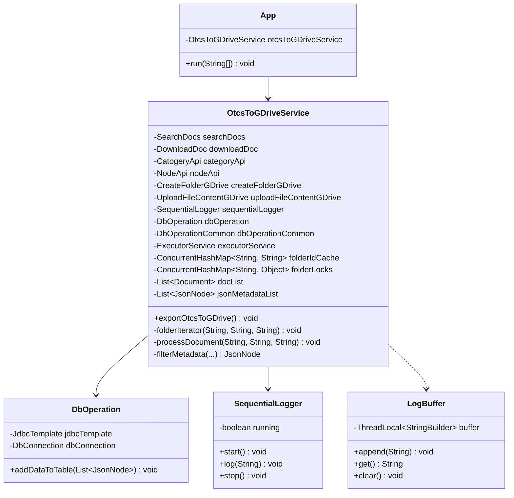

# Low-Level Design (LLD): OpenText to Google Drive Batch Exporter
## (Production-Ready Architecture Edition)

This document describes the Low-Level Design (LLD) of the **P01_OtcsToGdrive_AolExp_Dynamic_Col** batch migration tool. It covers class specifications, package layouts, thread configurations, and SQL database operations.

---

## 1. Class Structure & Concurrency Dependencies

The application runs as a Spring Boot command-line program, orchestrating multi-threaded migration tasks using thread-safe caches, pooled clients, and transactional DB wrappers.



---

## 2. Class & Component Details

### A. Core Batch Orchestrator

#### `OtcsToGDriveService`
Coordinates the parallel execution of the migration job.
*   **Properties**:
    - `executorService`: `Executors.newFixedThreadPool(30)` - Creates a fixed thread pool of 30 worker threads.
    - `folderIdCache`: `ConcurrentHashMap<String, String>` - Caches GDrive folder IDs indexed by their folder path.
    - `folderLocks`: `ConcurrentHashMap<String, Object>` - Thread locks to sync GDrive folder checks.
    - `docList`: `Collections.synchronizedList(new ArrayList<>())` - Thread-safe accumulator for CSV data.
*   **Methods**:
    - `exportOtcsToGDrive()`: Initiates directory traversal (`folderIterator`), shuts down the thread pool, awaits termination, and executes batch SQL writes.
    - `folderIterator(parentId, parentFolderPath, type)`: Recursively calls search APIs to discover child items. Directories trigger further recursion, while document nodes (`type == 144`) are submitted to the thread pool for processing.
    - `processDocument(id, name, parentFolderPath)`: Executes within a worker thread. Downloads document bytes, executes double-checked folder checks, uploads the file to GDrive, and registers metadata.

---

### B. Database Operations Layer (`com.supai.app.dao.dbaction`)

#### `DbOperation`
Manages batch metadata loading into the database.
*   **Method**: `addDataToTable(List<JsonNode> jsonMetadataList)`:
    - Performs SQL batch insertions. Converts the lists of JSON metadata into SQL query parameter maps and calls `jdbcTemplate.batchUpdate(INSERT_QUERY, batchArgs)`. This executes all records in a single JDBC command roundtrip.

---

### C. Logging & Observability Utilities (`com.supai.app.services.common`)

#### `LogBuffer` & `SequentialLogger`
Prevents interleaving of logs in the console during concurrent thread execution.
*   **`LogBuffer`**: Uses a `ThreadLocal<StringBuilder>` structure to buffer log strings produced during the lifecycle of a single thread execution context.
*   **`SequentialLogger`**: Flushes the collected `StringBuilder` contents to the console in a single, synchronized operation (`log(String)`) when the thread terminates, keeping logs clean and sequential.

---

## 3. High-Performance Configuration Options

### Database Connection Pool Configuration
We leverage **HikariCP** as our high-performance JDBC connection pool:

```properties
spring.datasource.hikari.minimum-idle=10
spring.datasource.hikari.maximum-pool-size=50
spring.datasource.hikari.idle-timeout=30000
spring.datasource.hikari.max-lifetime=2000000
spring.datasource.hikari.connection-timeout=30000
```
This ensures that the 30 threads executing parallel migrations can borrow database connections instantly without blocking or waiting.
